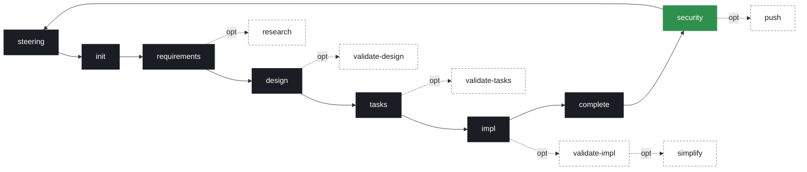

# blast — Spec-Driven Development for Claude Code

> **blast** = Błażej Strus' AI Development Life Cycle.
> Spec-first. Quality-enforced. No chaos.


## The problem

AI coding agents are fast, but raw speed without discipline is a liability. They make wrong assumptions and run with them, overcomplicate code and bloat abstractions ("1000 lines where 100 would do"), drift outside the task, and silently change code and comments they don't fully understand. The fix isn't a better model — it's a framework that communicates intent and **enforces** it.

**blast is that framework.** It forces order onto AI-assisted development: **first you know WHAT, then HOW, and only then you write code.** It ships as a set of agents and slash commands for [Claude Code](https://docs.anthropic.com/en/docs/claude-code) — generating specs, designs, and tasks, then implementing them with TDD, code review, security audit, and a behavior-preserving simplify pass.

## The pipeline



Solid spine = mandatory phases. Dashed = optional (research, three validations, simplify, push). Each gate requires human approval unless you bypass with `-y`. `simplify` is the only step that *subtracts* complexity instead of adding it.

## Why blast?

A fair comparison against the current state of the art (May 2026):

| Capability | raw Claude Code | GitHub Spec Kit | Amazon Kiro | **blast** |
|---|:---:|:---:|:---:|:---:|
| Spec → design → tasks gates | ✗ | ✓ | ✓ | ✓ |
| Project memory (steering) | partial | ✗ | ✓ | ✓ |
| Cross-artifact validation | ✗ | ✓ `/analyze` | partial | ✓ (4 validators) |
| Cross-spec DRY (inventory) | ✗ | ✗ | ✗ | ✓ |
| Constitution / governance | ✗ | ✓ | ✗ | ✓ (11 Articles) |
| Multi-LLM debate | ✗ | ✗ | ✗ | ✓ |
| Privacy / local-only LLM | ✗ | ✗ | ✗ | ✓ |
| Event-driven hooks (on-save) | ✗ | ✗ | ✓ | ✗ |
| Behavior-preserving **simplify** | ✗ | ✗ | ✗ | ✓ |
| Hard SDK-level approval gate | ✗ | ✗ | partial (IDE) | ✓ |
| Enforcement model | — | prompt templates | IDE-integrated | agents + hooks + gates |

Honest read: Spec Kit's `/analyze` and Kiro's on-save hooks are genuinely good ideas (Kiro's event-driven hooks are something blast doesn't do — it's prompt-driven, not IDE-embedded). Where blast pulls ahead is **enforcement depth** (deterministic SDK-level gates, not just templates), **cross-spec DRY**, **multi-LLM debate + privacy mode**, and **`/blast:simplify`** — a behavior-preserving complexity-reduction step neither competitor has.

## Karpathy-aligned, and then some

blast's four core AI rules — **Think Before Coding · Simplicity First · Surgical Changes · Goal-Driven Execution** — are the same four principles the community distilled from [Andrej Karpathy's notes on LLM coding pitfalls](https://github.com/multica-ai/andrej-karpathy-skills). The difference: those ship as a single passive `CLAUDE.md` you *hope* the model follows. blast **actively enforces** them:

- **Simplicity First** → `validate-tasks` (pre-impl KISS) + `/blast:simplify` (post-impl behavior-preserving reduction)
- **Surgical Changes** → `validate-impl` + `review`, including the comment guardrail ("never delete a comment you don't understand") and the "remove only your own orphans" rule
- **Goal-Driven Execution** → TDD by default + `validate-impl --prove` (runtime proof against the design's Verification Strategy)

Full rules: [`.blast/settings/rules/ai-collaboration.md`](.blast/settings/rules/ai-collaboration.md) and [`.blast/settings/rules/code-principles.md`](.blast/settings/rules/code-principles.md).

## Key features

- Spec-driven pipeline with **hard phase guards** (requirements → design → tasks → code) enforced at the SDK level, not just prompt-level
- **Local-first code generation** — implementation defaults to a local model (`qwen3.6:27b` dense, SWE-bench Verified 77.2 ≈ Sonnet 4.6) on your own GPU; cloud (Sonnet) is reserved for security-critical work or demonstrated failure. Fast, private, $0 per task.
- TDD implementation with ruff/ESLint **in the cycle**, not post-hoc — coverage is a signal, not a gate, and tests target behavior, not line counts
- **No traceability noise in source** — requirement IDs live in the spec, never as `# Req: N` tags in code
- Security audit (OWASP/CWE) built into the pipeline
- Code review with a 9-point scorecard (Clean Code, SOLID, KISS, DRY, YAGNI, patterns, SOTA, lint, docstrings)
- Behavior-preserving **`/blast:simplify`** — removes drift and over-abstraction, gated by the feature's Verification Strategy (reverts on red)
- Research/spike phase for unknown-territory features, backed by a local knowledge base
- Cross-spec DRY via a project inventory
- **Multi-LLM debate** (opt-in via `--debate`): HYBRID validate-impl/tasks (Sonnet ‖ qwen3.6 → Haiku judge) and JURY_3_FLASH3 for `--debate` design/review (Opus ‖ qwen3.6 ‖ Gemini-3-Flash → Haiku aggregator). `security` always uses the jury. Default validation is solo — debate buys little (~+5% recall) for the latency, so you opt into it.
- **Privacy mode** (`spec.json.privacy: local-only`) — all external LLM calls blocked by hook, falls back to local-only routing
- **MCP bridge for local Ollama** — `qwen3.6:27b` dense as the default code generator/critic and `qwen3.6` as general critic, all running free on a local GPU

## Quick start

### 1. Scaffold a new project

**Option A — `blast init` CLI** (recommended; clones template, wipes author's specs/code, resets steering, fresh git):

```bash
curl -sSL https://raw.githubusercontent.com/blablast/blast-spec-driven-development-framework/main/.claude/scripts/blast-init.py | python3 - my-project
cd my-project
```

**Option B — manual clone** (inherit author's R&D as reference):

```bash
gh repo clone blablast/blast-spec-driven-development-framework my-project
cd my-project && rm -rf .git && git init
```

### 2. Initialize project memory

```bash
/blast:steering
```

### 3. Build a feature

```bash
# Full pipeline — from description to shipped code
/blast:full "User authentication with OAuth2" --auto

# Or step by step:
/blast:init "User authentication with OAuth2"
/blast:requirements user-auth-oauth2
/blast:design user-auth-oauth2
/blast:tasks user-auth-oauth2
/blast:impl user-auth-oauth2
/blast:complete user-auth-oauth2
/blast:security user-auth-oauth2
```

### 4. Shortcuts

```bash
/blast:quick "Contact form with validation" --auto          # spec only, no code
/blast:full "Payment gateway" --auto --research --push      # full pipeline + research + push
/blast:review user-auth-oauth2 --fix                        # code review
/blast:simplify user-auth-oauth2 --apply                    # cut complexity, re-verify
/blast:security --all                                       # audit entire codebase
```

### Zero-config

blast works out-of-the-box on a Claude Code subscription — **no API keys** for the basic pipeline. Multi-LLM debate, jury review, and privacy mode are opt-in via `.env` (see `.blast/.env.example`).

## Commands

| Command | Description |
|---|---|
| `/blast:steering` | Initialize/sync project memory |
| `/blast:init "desc" [--source file]` | Create new feature spec |
| `/blast:requirements {f}` | Generate EARS requirements |
| `/blast:research {f} [--deep]` | Spike/research — compare options |
| `/blast:design {f} [-y]` | Generate technical design |
| `/blast:tasks {f} [-y]` | Generate implementation plan |
| `/blast:impl {f} [tasks]` | Implement with TDD + ruff, local-first (cloud escalation only when needed) |
| `/blast:review {f} [--fix]` | Code review vs principles |
| `/blast:simplify {f} [--apply]` | Behavior-preserving code reduction after impl (report-first; `--apply` cuts + re-verifies) |
| `/blast:security {f} [--fix] [--all]` | Security audit (OWASP/CWE) |
| `/blast:complete {f}` | Ship feature → inventory + changelog |
| `/blast:push [f]` | Git commit + push (smart staging) |
| `/blast:quick "desc" [--auto] [--research]` | Spec pipeline (init → tasks) |
| `/blast:full "desc" [--auto] [--research] [--push]` | Full pipeline (init → push) |
| `/blast:status {f}` | Check progress |
| `/blast:validate-tasks {f}` | KISS + SOTA review of tasks before impl |
| `/blast:learn` | Self-improvement: aggregate lessons / cost calibrate / routing |
| `/blast:help [cmd]` | Help and reference |

**30 commands, 22 agents (18 top-level + 4 debate).** Full reference: `/blast:help` or [`.blast/README.md`](.blast/README.md).

## Governance — the Constitution

The project's binding principles live in [`.blast/CONSTITUTION.md`](.blast/CONSTITUTION.md) — eleven Articles covering spec-driven discipline, local-first/tiered LLM routing, opt-in multi-LLM debate, privacy mode, TDD enforcement, cross-spec DRY, lifecycle, determinism boundaries, and conscious-duplicate policy. Steering files (`product.md`, `tech.md`, `structure.md`, `INVENTORY.md`) are the operational expansion of those Articles. If anything conflicts with steering, the Constitution wins for governance intent.

## Knowledge base

`.blast/knowledge/` — local knowledge the research agent searches **before** the internet:

- **`decisions/`** — architectural decisions (ADR); research respects existing decisions
- **`references/`** — API docs, library gotchas, saved articles
- **`research/`** — auto-generated summaries from previous `/blast:research` runs
- **`sota/`** — curated state-of-the-art recommendations per technology area, read by `validate-tasks` before suggesting library alternatives

## Install paths — drop-in vs fresh-project

blast ships almost everything inside `.blast/` and `.claude/` namespaces, so it can be dropped into an existing project without colliding with your own root files. Three things still need a tiny bit of wiring at the repo root, and blast provides them as **snippets** you either merge (drop-in) or auto-copy (fresh-project).

### What's in `.blast/` namespace vs root

| File | Where blast ships it | Why |
|---|---|---|
| `MANIFEST.md` | `.blast/MANIFEST.md` | framework metadata — no collision with `MANIFEST.in` / your own |
| `.env.example` | `.blast/.env.example` | source-of-truth; root `.env` is your own |
| `CLAUDE.md` content | `.blast/CLAUDE.snippet.md` | framework rules; your root `CLAUDE.md` `@`-includes it |
| `.gitignore` patterns | `.blast/.gitignore.snippet` | only blast-specific lines; append to your `.gitignore` |
| `.mcp.json` entry | `.blast/.mcp.json.snippet` | only the `blast-llm-bridge` server entry to merge into your `.mcp.json` |
| `.blast/` and `.claude/` | as-is | the framework itself — your project keeps these in place |

### Fresh-project install (no existing repo)

The `blast init` CLI does the wiring for you — it copies snippets into root and substitutes your project name:

```bash
curl -sSL https://raw.githubusercontent.com/blablast/blast-spec-driven-development-framework/main/.claude/scripts/blast-init.py | python3 - my-project
cd my-project
```

Result: your project has `CLAUDE.md`, `.env`, `.gitignore`, `.mcp.json` at root pre-wired to blast, plus full `.blast/` and `.claude/` frameworks.

### Drop-in install (existing project)

If you already have a project with your own `CLAUDE.md` / `.gitignore` / `.mcp.json`, copy only the framework directories and **manually merge** the four snippets:

```bash
# 1. Copy framework dirs into your project
cp -r .blast/ .claude/  /path/to/your-project/

# 2. Wire root CLAUDE.md — add this one line near the top
echo "@.blast/CLAUDE.snippet.md" >> /path/to/your-project/CLAUDE.md

# 3. Append blast's gitignore patterns to yours
cat .blast/.gitignore.snippet >> /path/to/your-project/.gitignore

# 4. Merge blast-llm-bridge entry into your .mcp.json
#    Open .blast/.mcp.json.snippet, copy the "blast-llm-bridge" object,
#    paste it into your existing .mcp.json under "mcpServers".

# 5. Copy .env.example contents into yours (manually merge variables)
cat .blast/.env.example >> /path/to/your-project/.env.example
```

After this your existing root files keep working, blast layers on top.

### Cloning the author's template directly

```bash
gh repo clone blablast/blast-spec-driven-development-framework my-new-project
cd my-new-project
rm -rf .git .blast/specs/          