# `.blast` — Spec-Driven Development

> *Para-academic technical paper — first draft.*
> *Author: Błażej Strus. Date: 2026-05-07.*
> *Status: working document, exposition of `blast`.*

---

## Abstract

This paper describes **`blast`**, an opinionated framework for spec-driven AI-assisted software development built on top of Claude Code. The framework formalises the development life-cycle as a deterministic phase pipeline (init → requirements → research → design → tasks → impl → complete → security → steering, with optional validation gates), enforced at three layers: a per-spec JSON state machine, eighteen named personas mapped to specialised subagents, and SDK-level hooks that bypass LLM reliability variance. A multi-LLM jury system (HYBRID and JURY_3_FLASH3 compositions) routes high-stakes validation decisions through three different model classes in parallel — Anthropic Sonnet/Opus, local Qwen3 via Ollama, and Google Gemini 3 Flash — with an aggregator that explicitly flags unanimous-zero-dissent verdicts as suspicious (a mitigation against the consensus cascade documented by the M3MAD-Bench Q1 2026 evaluation). We position `blast` against the contemporary SDD landscape (Kiro, GitHub Spec Kit, BMAD-METHOD) and argue it is competitive at the frontier on ten of twenty-one technical dimensions, ahead in seven (parallel multi-vendor jury, tiered cost routing, privacy-mode local fallback, cross-spec component registry, cost ceilings per phase, automated SOTA refresh, lifecycle-beyond-ship), behind in four (mostly distribution: scaffold CLI, multi-IDE support, public visibility, packaged release). The framework is presented as configuration-as-code under `.blast/` and `.claude/`, fully open-source under the project repository, designed for individual practitioners and small teams that want spec discipline without committing to a vendor IDE.

---

## Table of Contents

1. [Introduction](#1-introduction)
2. [Related Work — SDD Landscape 2026](#2-related-work--sdd-landscape-2026)
3. [`blast` Architecture](#3-blast-architecture)
4. [The Pipeline](#4-the-pipeline)
5. [The Personas](#5-the-personas)
6. [Multi-LLM Debate System](#6-multi-llm-debate-system)
7. [Hooks and Determinism](#7-hooks-and-determinism)
8. [Memory, Knowledge, Self-Improvement](#8-memory-knowledge-self-improvement)
9. [Lifecycle Beyond Ship](#9-lifecycle-beyond-ship)
10. [Evaluation](#10-evaluation)
11. [Limitations and Future Work](#11-limitations-and-future-work)
12. [Conclusion](#12-conclusion)
13. [References](#13-references)
14. [Appendix A: Command Reference](#appendix-a-command-reference)
15. [Appendix B: Glossary](#appendix-b-glossary)

---

## 1. Introduction

### 1.1 The vibe-coding problem

By mid-2025 it became routine to delegate substantial coding work to large language models. The default failure mode of that delegation — what the practitioner community called *vibe coding* — is a session in which the developer types a wish, the model produces something that looks plausible, and the work proceeds with no shared specification, no test, no verification step, no contract that future-self or future-collaborator could inherit. The artefact is the conversation transcript; the conversation transcript is fragile; the code that survives is by accident.

Spec-Driven Development (SDD) is the structured response to that failure. The bet is simple: if the model writes code best when it has clear inputs (requirements, design, tasks), the right discipline is to make those inputs first-class artefacts that humans review before code is generated. Code becomes the *output* of a deterministic pipeline, not the input. The pipeline is what a tool can enforce; the artefacts are what humans actually own.

Several frameworks adopted variants of this idea in 2024–2026. Kiro (Amazon) shipped an IDE-first experience with explicit `requirements.md / design.md / tasks.md` artefacts. GitHub published Spec Kit with a Constitution-as-governance pattern. The community produced BMAD-METHOD, OpenSpec, Tessl, Agent OS, and a long tail of similar projects. By Q1 2026 the space was crowded enough that Martin Fowler's IEEE article *"Spec-Driven Development is Eating Software Engineering"* could survey thirty-plus frameworks without much trouble.

### 1.2 What this paper claims

`blast` is one of those frameworks. The motivation for documenting it as a stand-alone artefact (rather than a README or a series of blog posts) is that the design has converged on a small set of decisions that are individually unremarkable but jointly atypical:

1. **Deterministic gates** at the SDK level — not prompts that ask the model to be careful — for approval, privacy, and telemetry.
2. **A persona layer** — each phase has a named character (Atlas designs, Forge implements, Crucible validates designs) — explicitly to make role separation legible to both developer and model.
3. **A multi-vendor jury** that runs Anthropic + Google + local Qwen in parallel for high-stakes validation, with an aggregator that *flags unanimous consensus as suspicious* per the M3MAD-Bench plateau finding.
4. **Tiered cost routing**: cheap local Qwen for stateless code generation, Sonnet for orchestration, Opus for architecture and security, Gemini for cross-vendor diversity in juries.
5. **A privacy mode** that hard-blocks every cloud LLM call (not by trusting the agent — by registering a `PreToolUse` hook that exits 2 on any external tool invocation).
6. **A cross-spec component registry** (`INVENTORY.md`) that prevents re-inventing already-shipped components without explicit justification.
7. **A self-improvement loop** that runs every five shipped specs and updates steering, cost calibration, and SOTA references.

The claim is not that any of these is novel in isolation. It is that the combination, executed with a determinism-first attitude, produces a developer experience that is measurably ahead of the contemporary SOTA on technical depth — even though `blast` lags in distribution and packaging.

### 1.3 Contribution and structure

This document contributes:

- A **reference description** of `blast`'s architecture and pipeline, accurate to the repository state at commit `82d44f7` (2026-05-07).
- A **comparison matrix** of `blast` against Kiro, Spec Kit, and BMAD across twenty-one technical dimensions.
- A **discussion of the multi-LLM jury system**, including the M3MAD-Bench plateau mitigation, that is not present in the surveyed alternatives.
- A **command reference** (Appendix A) covering thirty-one slash commands and twenty-three subagents.

Sections 2–9 are descriptive. Section 10 is evaluative. Sections 11–12 are honest about gaps.

---

## 2. Related Work — SDD Landscape 2026

The list below is not exhaustive; it covers the four frameworks most often referenced in 2026 and the patterns common to the broader population.

### 2.1 Kiro (Amazon Web Services)

Kiro is a Visual-Studio-Code-derived IDE released by AWS at the AWS Summit New York 2025. It generates `requirements.md` (in EARS notation), `design.md`, and `tasks.md` for each spec, and ships a hooks system that fires on file save (e.g. "regenerate tests when this source file changes"). The model backend is Claude Sonnet via Bedrock. Pricing has stabilised at $20/month for individual developers.

**Strengths.** Tight IDE integration (file watchers, inline diagnostics, agent steering through a side panel). EARS as a default keeps requirements parseable. Kiro hooks predate Claude Code's hook system and are arguably more developer-facing.

**Limitations.** Vendor IDE. Sonnet-only (no Opus, no local fallback). No multi-LLM debate. No cross-spec component registry. The constitution is implicit (configurable through workspace settings, not surfaced as a versioned artefact).

### 2.2 GitHub Spec Kit

GitHub published Spec Kit in late 2025 as an open-source toolkit for spec-driven development. The headline feature is a **constitutional layer**: a `constitution.md` file containing nine "Articles" that govern subsequent phases, plus a Phase −1 gate that compares each spec proposal against the constitution before allowing the project to enter Phase 0 (Specify).

The workflow is `/speckit.constitution → /specify → /plan → /tasks → /implement`, designed to work with Copilot, Claude Code, or Gemini CLI.

**Strengths.** Constitutional governance is the most rigorous abstraction in the field — it elevates project-wide invariants from steering files into a first-class document with explicit version history. CLI scaffolding (`specify init`) is polished.

**Limitations.** Single-agent execution per phase. No multi-LLM jury. No persona system. No tiered cost routing or privacy mode. The Articles are well-scoped but small in number; downstream work happens in plan/tasks files that are mostly free-form.

### 2.3 BMAD-METHOD

BMAD-METHOD ("Breakthrough Method for Agile AI-Driven Development") shipped v6.6.0 in April 2026 and reached 46.2k GitHub stars. Its distinctive contribution is a **skills architecture** — composable units of agent capability stored as YAML schemas that can be stacked and referenced across the SDLC. BMAD also has a strong persona system (named agents per phase, similar in spirit to `blast`).

**Strengths.** Largest community in the field. Skills compose — adding a new capability is a matter of writing a skill, not editing a slash command. Persona system is mature. Multiple agent backends supported.

**Limitations.** No multi-vendor jury (single-agent per skill at a time). No SDK-level hooks for deterministic gates (skill discipline relies on prompt). Constitution-equivalent is implicit. Tiered cost routing is not central to the design.

### 2.4 Other notable frameworks

- **OpenSpec** — minimalistic, Markdown-only, no agent integration; targets pure-spec workflows that hand off to any LLM.
- **Tessl** — focuses on test-driven generation; adjacent to SDD but treats tests as primary specification.
- **Agent OS** — multi-agent runtime focused on long-running autonomous workflows, less on spec discipline.
- **Spec Kitty** — a community fork of Spec Kit with additional templates.

### 2.5 Common patterns and gaps

Across the surveyed frameworks, the following patterns appear consistently:

| Pattern                                                 | Frequency                                                                   |
| ------------------------------------------------------- | --------------------------------------------------------------------------- |
| Three-phase artefact pipeline (req/design/tasks → code) | universal                                                                   |
| Markdown as the lingua franca of artefacts              | universal                                                                   |
| Approval gates between phases                           | most                                                                        |
| Persona / named-agent system                            | BMAD, `blast`; partial elsewhere                                            |
| Constitutional governance file                          | Spec Kit, `blast`; implicit elsewhere                                       |
| Multi-LLM jury for validation                           | **none** of the surveyed                                                    |
| Privacy-mode local fallback                             | **none** of the surveyed                                                    |
| Cross-spec component registry                           | **none** of the surveyed                                                    |
| SDK-level hooks for determinism                         | Kiro (file-save hooks), `blast` (pre-tool-use hooks); others rely on prompt |
| Tiered cost routing                                     | **none** explicit                                                           |

The gaps in the right-hand column are where `blast` makes contributions specific to the framework. They are documented in Sections 6–8.

The plateau-of-AI-debate concern, raised by M3MAD-Bench at ICLR 2026, is a separate gap in the *literature* (not just the framework landscape): most multi-agent SDD systems treat unanimous agreement as a confirmation of correctness, when empirically unanimous-zero-dissent verdicts on real designs are statistically rare and usually indicate a confidence cascade rather than ground-truth-correctness. We discuss this in §6.4.

---

## 3. `blast` Architecture

### 3.1 Repository layout

The framework is configuration-as-code. A `blast`-enabled project has the following structure:

```
project-root/
├── .blast/
│   ├── CONSTITUTION.md           Top-level governance (Articles I-XI)
│   ├── README.md                 Narrative description of `.blast/`
│   ├── settings/
│   │   ├── rules/                EARS, design-review, code-principles, ai-collaboration
│   │   └── templates/            specs/ + steering/ + debates/ scaffolds
│   ├── knowledge/
│   │   ├── sota/                 Curated SOTA recommendations per domain
│   │   ├── research/             Per-feature research outputs
│   │   ├── decisions/            Architectural decision records (ADRs)
│   │   └── references/           Saved docs, API specs, library notes
│   ├── steering/                 Project memory (operational)
│   │   ├── product.md            Purpose, invariants, capabilities
│   │   ├── tech.md               Stack, canonical commands, gotchas, security patterns
│   │   ├── structure.md          File layout and naming
│   │   ├── INVENTORY.md          Cross-spec component registry
│   │   ├── llm-routing.md        Debate compositions + cost ceilings
│   │   ├── cost-policy.md        Per-phase cost ceilings (optional)
│   │   └── RESEARCH.md           Accumulated research patterns (optional)
│   └── specs/{feature}/          Per-feature artefacts
│       ├── spec.json             State machine + approvals
│       ├── requirements.md       EARS user stories
│       ├── research.md           Research log (optional)
│       ├── design.md             Architecture + verification strategy
│       ├── tasks.md              Implementation tasks
│       ├── debates/              Per-phase debate scratchpads
│       ├── validation/           Validation reports
│       ├── security/             Security audit report
│       └── evolutions/           Delta-specs for shipped features
├── .claude/
│   ├── commands/blast/           31 slash commands
│   ├── agents/blast/             19 phase agents + 4 debate subagents
│   ├── hooks/                    3 SDK-level gates (Python)
│   ├── mcp/blast-llm-bridge.py   MCP server — Ollama + Gemini providers
│   ├── scripts/                  Project automation (10 scripts)
│   └── settings.json             Hooks registry + Bash allowlist
├── CLAUDE.md                     AI instructions (auto-loaded by Claude Code)
├── README.md                     User-facing readme
├── MANIFEST.md                   Distribution classification (FRAMEWORK/HYBRID/R&D)
└── .env.example                  Environment template
```

This shape is deliberate. `.blast/` is the project's *long-term memory*; `.claude/` is the *agent runtime*. They are separate so that a developer can switch IDE tooling (e.g. between Claude Code and another agent) without rewriting their specs and steering, and so that framework upgrades touch only the runtime side.

### 3.2 The Constitution and steering hierarchy

`.blast/CONSTITUTION.md` is the binding governance document. It encodes eleven Articles:

| Article | Subject                                                  |
| ------- | -------------------------------------------------------- |
| I       | Spec-Driven, Three-Phase Discipline                      |
| II      | Steering Is Project Memory                               |
| III     | Multi-LLM Debate Is the Default for Validation (SOTA #1) |
| IV      | Tiered Cost Routing                                      |
| V       | Privacy Mode Is a First-Class Citizen                    |
| VI      | TDD Is the Default Implementation Discipline             |
| VII     | Cross-Spec DRY via INVENTORY                             |
| VIII    | Self-Improvement Loop                                    |
| IX      | Lifecycle Beyond Ship                                    |
| X       | Determinism Where It Matters                             |
| XI      | Conscious Duplicates Are Allowed                         |

Each Article is short (one paragraph of intent + one paragraph of operational mapping). The Articles describe what is invariant; the steering files (`product.md`, `tech.md`, `structure.md`, `INVENTORY.md`) operationalise them and may be updated per-spec without amending the Constitution. If a steering file conflicts with an Article, the Constitution wins for governance intent.

This split mirrors the legal-document analogue (Constitution / Statutes / Regulations) and aligns with the "constitutional AI" framing pioneered by Spec Kit, with the difference that `blast` operationalises the Articles via concrete enforcement (hooks for Article X, INVENTORY.md for Article VII, debate triggers for Article III) rather than relying on the constitution being read as a guideline by every agent.

### 3.3 Per-spec state machine

Each feature spec has a `spec.json` state machine:

```json
{
  "feature_name": "rate-limited-http-client",
  "phase": "tasks-generated",
  "status": "active",
  "language": "pl",
  "approvals": {
    "requirements": { "approved": true, "approvedAt": "2026-05-07T..." },
    "design": { "approved": true, "approvedAt": "..." },
    "tasks": { "approved": true, "approvedAt": "..." }
  },
  "complexity_hint": "high",
  "security_critical": true,
  "privacy": null,
  "ready_for_implementation": true,
  "provides": [...],
  "dependencies": [...]
}
```

The `approvals.{phase}.approved` boolean is the deterministic gate read by the `blast-approval-gate.py` hook (described in §7). The `complexity_hint` and `security_critical` fields drive auto-fire heuristics for validation phases. The `privacy` field, when set to `"local-only"`, is read by `blast-privacy-gate.py` and blocks every external LLM call for that spec.

### 3.4 Determinism boundaries

Three places in `blast` are intentionally not LLM-decided, because LLMs proved unreliable in early iterations:

1. **Approval gates.** The `blast-approval-gate.py` hook runs as `PreToolUse` on Agent/Task invocations, reads `spec.json.approvals`, and exits with code 2 if a required approval is missing. The agent does not run.
2. **Privacy gate.** The `blast-privacy-gate.py` hook reads `spec.json.privacy` and blocks every external tool call (`mcp__plugin_*`, WebSearch, WebFetch outside of allowed domains) when the spec is local-only.
3. **Routing decision in slash commands.** The orchestrator pattern (§6.3) places the FIRE/SKIP debate decision in the slash command, where the LLM has narrow context and a single decision to make, rather than in the agent, where it competes with the validation work.

The principle: if you find yourself debugging why an agent "decided" to skip something, move the decision to a deterministic gate. The cost of writing a hook is small; the cost of LLM unreliability compounds.

---

## 4. The Pipeline

### 4.1 Phase graph

```mermaid
graph LR
    A[init] --> B[requirements]
    B --> C{research?}
    C -->|--research| D[research]
    C -->|skip| E[design]
    D --> E[design]
    E --> F{validate-design?}
    F -->|--validate| G[validate-design]
    F -->|skip| H[tasks]
    G --> H[tasks]
    H --> I{validate-tasks?}
    I -->|auto-fire/--validate| J[validate-tasks]
    I -->|skip| K[impl]
    J --> K[impl]
    K --> L{validate-impl?}
    L -->|--validate| M[validate-impl --prove]
    L -->|skip| N[complete]
    M --> N[complete]
    N --> O[security]
    O --> P[steering sync]
    P --> Q{push?}
    Q -->|--push| R[push]
    Q -->|skip| S((shipped))
    R --> S
```



The mandatory phases form a linear backbone: `init → requirements → design → tasks → impl → complete → security → steering`. Optional phases (`research`, `validate-*`) insert at fixed points. The `--auto` flag of `/blast:full` runs every phase without prompting between them; the `--validate` flag inserts the three validation phases; `--research` inserts research; `--push` appends a final commit-and-push.

### 4.2 Approval gates (deterministic)

The arrows in §4.1 between productive phases (requirements, design, tasks) carry an implicit approval gate. The gate is enforced by `blast-approval-gate.py` at SDK level, not by prompt:

```
spec-design-agent     requires  approvals.requirements.approved == true
spec-tasks-agent      requires  approvals.design.approved       == true
spec-tdd-impl-agent   requires  approvals.tasks.approved        == true
```

There are five bypass paths, all explicit:

1. `subagent_type` is not one of the three productive agents (e.g. validation, security)
2. The subagent prompt contains the exact line `Auto-approve: true` (set by slash commands invoked with `-y`)
3. The subagent type is `spec-tiny-agent` (compressed flow, self-approved)
4. `spec.json.tiny == true`
5. The Bypass paths fire silently — the agent runs without further checking.

If none of those bypass paths apply and the prior phase is not approved, the hook returns exit code 2 and the agent does not run. The slash command displays the next-step suggestion (e.g. "run `/blast:approve {f} requirements`").

### 4.3 Slash commands catalogue

Thirty-one slash commands are exposed at the time of writing. They cluster into four groups:

**Pipeline phases (10):**

- `/blast:init` — create new spec from description
- `/blast:requirements` — generate EARS requirements
- `/blast:research` — research / spike phase
- `/blast:design` — generate technical design
- `/blast:tasks` — generate implementation tasks
- `/blast:impl` — execute TDD implementation
- `/blast:complete` — mark feature shipped, update INVENTORY
- `/blast:security` — security audit (always runs jury)
- `/blast:steering` — bootstrap or sync steering files
- `/blast:steering-custom` — generate custom steering files (auth, db, deploy, etc.)

**Validation phases (4):**

- `/blast:validate-gap` — gap analysis vs existing codebase (brownfield)
- `/blast:validate-design` — design review (orchestrator → debate or solo)
- `/blast:validate-tasks` — KISS+SOTA review (Pragmatist persona)
- `/blast:validate-impl` — implementation validation, with `--prove` runtime verification

**Lifecycle (4):**

- `/blast:approve` — manual approval of a phase
- `/blast:evolve` — delta-spec for shipped feature
- `/blast:deprecate` — mark feature deprecated, generate migration guide
- `/blast:status` — show pipeline state of one or all specs

**Compositions and meta (13):**

- `/blast:full` — full pipeline (all phases) with optional `--auto / --research / --validate / --push`
- `/blast:quick` — spec-only pipeline (init → req → design → tasks)
- `/blast:tiny` — single-agent compressed spec for trivial features
- `/blast:debate` — orchestrate a multi-juror debate on a topic
- `/blast:review` — code review against principles
- `/blast:learn` — self-improvement aggregator (lessons + cost calibrate + routing observability + SOTA refresh)
- `/blast:lint` — local Qwen-driven secondary lint pass
- `/blast:graph` — extract dependency graph from specs
- `/blast:drift` — detect drift between spec and codebase
- `/blast:telemetry` — show telemetry (debate frequency, costs, latencies)
- `/blast:ping-llm` — smoke-test MCP bridge
- `/blast:push` — commit and push current branch
- `/blast:help` — command reference

A full reference for each command, including arguments and behaviour, is in Appendix A.

### 4.4 Optional vs mandatory

Optional phases earn their place by *catching real bugs that the mandatory phases miss*, not by adding ceremony. In smoke testing during development of `blast`, the following bugs were caught only by validation phases:

- `cached_property` × `@dataclass(frozen=True)` runtime crash (caught by `validate-design` debate)
- `asyncio.get_event_loop()` as default argument value (caught by `validate-design` debate)
- `AsyncTokenBucket` FIFO contract under-specification (caught by `validate-design` debate)
- REQ 25.2 async method naming violation (`get` vs `aget`) (caught by `validate-impl` debate)
- SSRF documentation gap (caught by `security` jury)
- CWE-200 query-string secret leak in exception messages (caught by `security` jury)

Each of those is a real defect that solo Sonnet review missed in the same project. The `--validate` flag is therefore the recommended default for any spec with `complexity_hint: high` or `security_critical: true`.

---

## 5. The Personas

### 5.1 Why personas

Each phase agent has a name and a one-paragraph role description before any technical instructions. This is a deliberate design choice, not decoration. Three reasons:

1. **Role separation.** "Atlas designs" is shorter and more distinct than "the agent currently performing the design phase". When a multi-agent debate needs to refer to "what Atlas committed to" it can do so unambiguously.
2. **Self-bias check.** Each persona has a stated *weakness* — e.g. "Atlas-bias: pushing for elegance over pragmatism". Agents are instructed to label their own bias explicitly when they catch themselves drifting toward the weakness. This produces audit trails like *"⚠ Atlas-bias: rejected the Transport adapter abstraction as over-engineered. Withdrawing suggestion."*
3. **Per-phase voice.** A persona has a documented *style*. Scribe writes EARS literally; Forge does TDD red-green-refactor; Pragmatist asks "does this task earn its weight?". The voice keeps each phase's outputs distinguishable from the others, which matters when reading a spec months later.

### 5.2 The cast

Eighteen named personas + four debate roles + one alias:

| Phase / role              | Persona                    | Subagent                          | Model         |
| ------------------------- | -------------------------- | --------------------------------- | ------------- |
| Requirements              | **Scribe**                 | spec-requirements-agent           | haiku         |
| Research / spike          | **Oracle**                 | research-spike-agent              | sonnet        |
| Design                    | **Atlas**                  | spec-design-agent                 | opus          |
| Tasks                     | **Loom**                   | spec-tasks-agent                  | haiku         |
| Implementation (TDD)      | **Forge**                  | spec-tdd-impl-agent               | sonnet        |
| Tiny / compressed spec    | **Sprint**                 | spec-tiny-agent                   | haiku         |
| Evolve (delta-spec)       | **Delta**                  | spec-evolve-agent                 | sonnet        |
| Complete / retrospection  | **Ledger**                 | spec-complete-agent               | haiku         |
| Deprecate / EOL           | **Curator**                | spec-deprecate-agent              | haiku         |
| Validate-gap (brownfield) | **Bridge**                 | validate-gap-agent                | sonnet        |
| Validate-design           | **Crucible**               | validate-design-agent             | sonnet        |
| Validate-tasks            | **Pragmatist**             | validate-tasks-agent              | sonnet        |
| Validate-impl             | **Auditor**                | validate-impl-agent               | sonnet        |
| Drift detection           | **Tracker**                | drift-agent                       | sonnet        |
| Code review               | **Compass**                | review-agent                      | sonnet        |
| Security audit            | **Sentinel**               | security-audit-agent              | opus          |
| Steering                  | **Cartographer / Steward** | steering-agent                    | sonnet        |
| Steering-custom           | **Specialist**             | steering-custom-agent             | haiku         |
| Debate — author           | Author                     | debate-author                     | sonnet        |
| Debate — critic           | Critic                     | debate-critic, debate-critic-opus | sonnet / opus |
| Debate — judge            | Judge                      | debate-judge                      | haiku         |
| Debate — aggregator       | Aggregator                 | debate-aggregator                 | haiku         |

The two names for the steering agent (Cartographer in the body, Steward in the description) are an unresolved naming inconsistency from an early refactor; the operational identity is unchanged.

### 5.3 Persona-bias self-check (worked example)

From `agents/blast/design.md`:

> **WEAKNESS YOU MUST WATCH FOR:** You over-engineer abstractions — pulling in Transport ports and BaseClass mixins when a frozen dataclass would do. When you catch yourself adding a layer because it "feels clean", LABEL EXPLICITLY:
> *"⚠ Atlas-bias: adding {abstraction} for {reason}. Withdrawing — frozen dataclass + 30 lines of duplication is a smaller change than the abstraction tax."*

This pattern surfaced an empirically observable behaviour in one of the development smoke tests: the design agent drafted an `_AsyncLockAdapter` (synchronous `__enter__/__exit__` wrapping `asyncio.Lock`) to share `RequestTracker` between sync and async lanes, then the validate-design debate caught the unsoundness, and the user-visible verdict envelope explicitly cited the bias-check as not having fired strongly enough. The fix was to split into `RequestTrackerV4` (sync) + `AsyncRequestTrackerV4` (async), with thirty lines of duplication, and the persona's weakness description was updated to mention the example.

### 5.4 Persona vs role

A persona is *not* an agent. The distinction matters: an agent is a Claude Code subagent definition (a Markdown file with frontmatter + instructions). A persona is a named identity that may be carried by one or more agents — the four debate sub-agents (Author, Critic, Judge, Aggregator) all live inside `/blast:debate` orchestrations and are spawned by the debate slash command, not summoned directly.

The persona naming is meant to be *human-friendly* for the developer; the agent naming (`spec-requirements-agent`, etc.) is what Claude Code's Task tool dispatches against.

---

## 6. Multi-LLM Debate System

### 6.1 Why debate

Solo-agent validation has a known failure mode: the same model produced both the artefact and the critique. The artefact's biases are the critique's biases. Two empirical examples from `blast`'s own validation runs:

- **REQ 25.2 violation.** Forge generated an async HTTP client that named methods `get`, `post`, `put`, `delete`, `close` — a verbatim copy of the sync surface. The requirements explicitly mandated `aget`, `apost`, etc. for async (REQ 25.2). Solo Sonnet validate-impl missed this on a first run; the HYBRID jury (Sonnet author + Qwen critic + Haiku aggregator) caught it because the Qwen critic, having been trained on a different corpus, cross-referenced the requirements and flagged the contract violation.
- **Frozen dataclass + cached_property.** Atlas generated a `Response` class with `@dataclass(frozen=True)` and `@cached_property` for `.text` and `.json`. The first invocation of `.text` would write to `instance.__dict__` and raise `FrozenInstanceError`. Solo Crucible (Sonnet) flagged the class layout but not the runtime crash. The JURY_3_FLASH3 jury (Opus + Qwen + Gemini) flagged it unanimously.

The hypothesis behind multi-LLM debate is that diversity-of-corpus catches diversity-of-bug. The hypothesis is empirically supported by the practitioner experience above and by the broader literature on ensemble methods.

### 6.2 Compositions

Two compositions are defined in `.blast/steering/llm-routing.md`:

**HYBRID** — used by `validate-impl`, `validate-tasks`:

```yaml
HYBRID:
  protocol: B   # parallel jury, N=2
  jurors:
    - { name: claude-sonnet-4-6, subagent: debate-critic }
    - { name: qwen3.6:latest,    mcp_tool: ask_ubuntu_qwen36 }
  aggregator:
    name: claude-haiku-4-5-20251001
    subagent: debate-aggregator
```

**JURY_3_FLASH3** — used by `validate-design`, `security`, `review`:

```yaml
JURY_3_FLASH3:
  protocol: B   # parallel jury, N=3
  jurors:
    - { name: claude-opus-4-6,         subagent: debate-critic-opus }
    - { name: qwen3.6:latest,          mcp_tool: ask_ubuntu_qwen36 }
    - { name: gemini-3-flash-preview,  mcp_tool: ask_gemini_3_flash_preview }
  aggregator:
    name: claude-haiku-4-5-20251001
    subagent: debate-aggregator
```

The wiring is explicit. Each juror is either a subagent (spawned by the Task tool, runs in its own context) or an MCP tool (called as a single tool invocation). If a juror's mechanism is unavailable — e.g. `GEMINI_API_KEY` is not set — the juror is *skipped and logged*, not simulated by another agent in cosplay. The aggregator records the degradation in the verdict envelope's `JUROR_DEGRADATIONS` field.

### 6.3 Protocol B mechanics

Protocol B is the jury vote protocol. The orthodox dispatch:

1. The orchestrator issues all juror calls **in a single message** so Claude Code dispatches them concurrently.
2. Each juror writes its verdict block to a shared scratchpad at `.blast/specs/{feature}/debates/{topic}.md`.
3. The aggregator (`debate-aggregator`, model `haiku`) reads the scratchpad, tallies votes, captures dissent verbatim, and emits the final verdict envelope.

A worked example — the security audit envelope from a recent smoke run:

```
---VERDICT---
VERDICT: WARN
BLOCKING: false
FINDINGS: 3
DISSENT_COUNT: 0
CONSENSUS_REVIEW_RECOMMENDED: true   # M3MAD-Bench mitigation
JUROR_DEGRADATIONS: none
NEXT_ACTIONS:
- Patch HttpClientException.__str__ to surface only redacted URL form
- Auto-redact headers= field values in StructuredLogger.log
- Optionally extend _redact_url to additional field aliases
- Re-run with Devil's Advocate (Protocol D) given consensus_review_recommended
---END---
```

The `CONSENSUS_REVIEW_RECOMMENDED: true` is the anti-plateau guard described in §6.4.

### 6.4 Anti-plateau guard (M3MAD-Bench)

The M3MAD-Bench evaluation, published at ICLR 2026, established empirically that multi-agent debate plateaus and can be subverted by misleading consensus: when two of three jurors confidently assert the wrong answer, a correct juror is statistically likely to defer rather than dissent. The corollary is that a unanimous-zero-dissent verdict on a real-world artefact is *suspicious*, not confirmatory — real designs almost always have at least one improvement opportunity, and unanimous "all green" usually indicates a confidence cascade.

`blast`'s aggregator implements an explicit guard:

> If `dissent_count == 0` AND `verdict ∈ {PASS, WARN}` AND `unique_critical_findings == 0`, set `consensus_review_recommended: true` in the envelope and recommend either a Devil's Advocate (Protocol D) round or human review.

The guard is *not* an automatic re-run — that would be expensive and would not necessarily break the cascade. It is a flag that surfaces to the human reviewer, who can then decide to invoke Protocol D (Devil's Advocate, where one critic is hard-required to find ≥3 weaknesses) or accept the unanimous verdict knowing it is uncalibrated.

This is, to our knowledge, the only public SDD framework that operationalises the M3MAD-Bench finding.

### 6.5 Tiered cost routing

The compositions above target different cost tiers:

| Phase                       | Composition                    | Approx cost |
| --------------------------- | ------------------------------ | ----------- |
| requirements (Scribe)       | solo Haiku                     | $0.001      |
| tasks (Loom)                | solo Haiku                     | $0.002      |
| design (Atlas)              | solo Opus                      | $0.05       |
| impl (Forge, simple)        | qwen3-coder via MCP            | $0 (local)  |
| impl (Forge, complex)       | Sonnet self-implementation     | $0.10–$0.30 |
| validate-tasks (Pragmatist) | HYBRID                         | $0.12       |
| validate-design (Crucible)  | JURY_3_FLASH3                  | $0.50       |
| security (Sentinel)         | JURY_3_FLASH3 (always)         | $1.00       |
| review (Compass)            | JURY_3_FLASH3 on auth/payments | $1.00       |

The local-first impl strategy (Forge, simple) is consequential. For pure functions, dataclasses, and stateless helpers, qwen3-coder running on a local RTX 5090 produces working code in roughly 30 seconds at near-zero marginal cost. Forge classifies tasks at the start of the impl phase and routes simple ones to the local model; complex ones (async, state machines, cross-cutting concerns) escalate to Sonnet.

The cost ceilings per phase are enforced soft-style: when a phase exceeds its `cost_ceiling_usd`, the verdict carries `"debate truncated"` in `NEXT_ACTIONS` rather than hard-stopping the pipeline. This avoids the worst failure mode (silent cost run-up) without the second-worst failure mode (hard-stop on an almost-complete debate).

### 6.6 Privacy mode

`spec.json.privacy: local-only` blocks every external LLM call via `blast-privacy-gate.py`. The gate is a `PreToolUse` hook that exits 2 on any matching tool name pattern:

```python
EXTERNAL_PATTERNS = (
    "WebSearch", "WebFetch",
    "mcp__plugin_*",
    "mcp__blast-llm-bridge__ask_gemini_*",
    # ask_ubuntu_qwen* permitted (local Ollama)
)
```

When privacy mode is active, debate compositions degrade to local-only:

- HYBRID → `[qwen3.6:latest, qwen3-coder:30b]` jurors, `qwen3.6:latest` aggregator
- JURY_3_FLASH3 → same, optionally with `gpt-oss:latest` as third juror if installed
- Cost ceiling drops to $0.00

This is hard-blocked at SDK level, not in prompt. A privacy-mode spec cannot accidentally leak to a cloud LLM through agent confusion.

---

## 7. Hooks and Determinism

### 7.1 Three hook gates

`blast` registers three hooks in `.claude/settings.json`:

```json
{
  "hooks": {
    "PreToolUse": [
      { "matcher": "^(Agent|Task)$",            "command": "python .claude/hooks/blast-approval-gate.py" },
      { "matcher": "^mcp__|^WebSearch|^WebFetch", "command": "python .claude/hooks/blast-privacy-gate.py" }
    ],
    "PostToolUse": [
      { "matcher": ".*", "command": "python .claude/hooks/blast-telemetry.py" }
    ]
  }
}
```

**Performance.** Each hook is ~15 ms (Python startup + I/O). Imperceptible at user-facing pace; matters at scale only when agents fire dozens of subagent calls per session.

**Failure modes.** Each hook has a defensive fallback: if `spec.json` cannot be parsed, the hook logs and exits 0 (permissive). The bias is toward not-blocking-development on hook errors, on the assumption that hook errors are framework bugs and shouldn't punish the user.

### 7.2 Why determinism

The general-purpose argument: *if you find yourself debugging why an agent decided to skip something, move the decision to a deterministic gate.* The cost of writing a hook is small; the cost of LLM unreliability compounds.

A specific argument: in the development of `blast`, the `validate-tasks` phase was found to silently skip in a `/blast:full --auto --validate` run despite `complexity_hint: high` and `security_critical: true`. The root cause was that the orchestrator agent was reading the phase as "optional" because the pipeline phase header said `(conditional)`. The fix was a TodoWrite injection plus header rewording — a deterministic fix, not a prompt-level "pay attention".

### 7.3 The orchestrator pattern

A related determinism move is the **orchestrator pattern** for validation slash commands. Rather than letting the validate-* agent decide whether to fire debate (early versions of `blast` did this; the agent ignored its own routing logic), the *slash command* deterministically:

1. Parses `--no-debate` flag from `$ARGUMENTS`
2. Reads `.blast/steering/llm-routing.md` for the phase's `debate_config`
3. Computes `DECISION ∈ {FIRE, SKIP}` using a documented algorithm
4. Emits `Routing: <FIRE|SKIP> — <reason>` as a literal output line
5. Branches to either `/blast:debate` or the solo agent

The agent gets a narrower scope (validate, do not decide on routing), and the routing line is auditable in the trace. The pattern is documented in §3.4 of `CLAUDE.md` and was a substantive refactor mid-2026.

---

## 8. Memory, Knowledge, Self-Improvement

### 8.1 Steering as project memory

`.blast/steering/` is the project's long-term memory, loaded automatically by every agent invocation. The four core files (`product.md`, `tech.md`, `structure.md`, `INVENTORY.md`) plus optional supplements (`llm-routing.md`, `cost-policy.md`, `RESEARCH.md`) form a contract between human and agent: *what is true about this project that you should know without being told.*

Steering is updated by three mechanisms:

1. **Bootstrap on fresh scaffold.** `/blast:steering` detects a fresh scaffold via the `BLAST_STUB` marker and runs an ASK Flow — five to seven user questions that populate steering from answers rather than inferring from framework files.
2. **Sync on shipped feature.** `/blast:complete` runs a retrospection that proposes lessons (gotchas, invariants, anti-patterns) for inclusion in `tech.md` / `product.md`. The agent applies the *near-neighbour check*: if a proposed lesson is close to an existing rule, refine the existing rule rather than add a new bullet.
3. **Drift detection.** `/blast:drift` and the steering agent's sync mode flag sections of steering that no longer match the codebase (e.g. an `Allowed Dependencies` list that's missing a library now imported in three modules).

### 8.2 Knowledge base and SOTA curation

`.blast/knowledge/` is the project's *long-term external knowledge*:

- `decisions/` — Architectural Decision Records (ADRs)
- `research/` — per-feature research findings, distilled
- `references/` — saved API specs, library notes, gotchas
- `sota/` — curated state-of-the-art recommendations per domain

The `sota/` directory is novel relative to the surveyed frameworks. Each file (`http-clients.md`, `async-patterns.md`, `database-orm.md`) contains:

- Last-refreshed date
- Recommended choices with rationale
- Anti-patterns and rejected alternatives
- Threshold for re-research

Pragmatist (validate-tasks) consults SOTA before suggesting library alternatives, which prevents the "model trained on 2023 data recommends a deprecated library" failure mode. Files older than six months are flagged by `/blast:learn --refresh-sota` for re-research.

### 8.3 Self-improvement loop

`/blast:learn` is a four-mode aggregator:

```
/blast:learn --lessons       # extract recurring patterns from completed specs into steering
/blast:learn --calibrate     # compare estimated vs actual cost per phase, update llm-routing.md
/blast:learn --routing       # log composition fire frequency and degradation events
/blast:learn --refresh-sota  # audit knowledge/sota/*.md for staleness
/blast:learn --all           # run all four
```

The loop fires automatically every five shipped specs (counter in `.blast/.shipped-counter`), making it cheap to keep steering and routing calibrated as the project ages. This is the only self-improvement loop in the surveyed SDD frameworks; the others rely on manual configuration drift management.

### 8.4 Cross-spec DRY: INVENTORY

`.blast/steering/INVENTORY.md` is a per-component table populated by `/blast:complete`. Schema:

```markdown
| Component | Type | Feature | Description |
|---|---|---|---|
| HttpClient | class | rate-limited-http-client | Sync HTTP client with rate-limit, retry, metrics |
| AsyncHttpClient | class | rate-limited-http-client | Async sibling of HttpClient |
| ...
```

Before designing a new component, the design agent (Atlas) checks INVENTORY for an existing match. Matching is heuristic (the agent uses semantic similarity on description), but the agent is required to *justify in design.md why a new component is needed* if INVENTORY already provides one. Re-inventing a shipped component without justification is a flag-able offense in `/blast:complete`'s retrospection.

---

## 9. Lifecycle Beyond Ship

A feature is not done when shipped. The lifecycle continues:

- **`/blast:evolve {feature} "<change>"`** generates a delta-spec under `.blast/specs/{feature}/evolutions/{N}-{slug}/`. The delta has a single approval gate (its own `evolution.md` and `tasks.md`), is implemented through `/blast:impl`, and is merged back into the parent spec via `/blast:complete` (which now routes through Step 0 in `spec-complete-agent`).
- **`/blast:deprecate {feature} --reason "..."`** marks a shipped feature as deprecated, generates a migration guide if a replacement exists, and flags dependent specs in INVENTORY. Status `deprecated` is honoured by other agents — they will not silently depend on a deprecated component.
- **`/blast:security {feature}`** is re-runnable post-ship; trigger `always` ensures security verdict is never solo Sonnet, even outside `--auto` flows.
- **`/blast:drift {feature}`** detects drift between spec and codebase, suggesting either a re-design (spec wrong) or a code refactor (code drifted from spec).

This explicit lifecycle differentiates `blast` from most surveyed frameworks, which treat *shipped* as terminal and rely on the developer to remember what was shipped.

---

## 10. Evaluation

### 10.1 Comparison matrix

The following is a feature-by-feature comparison of `blast` against Kiro, GitHub Spec Kit, and BMAD-METHOD as of 2026-05. Cells are: ✅ first-class supported, partial = present but not central, ❌ absent.

| Dimension                                          | Spec Kit                          | BMAD                          | Kiro          | `blast`                                                   |
| -------------------------------------------------- | --------------------------------- | ----------------------------- | ------------- | --------------------------------------------------------- |
| Three-phase pipeline (req → design → tasks → code) | ✅                                 | ✅                             | ✅             | ✅                                                         |
| Research / spike phase                             | ❌                                 | partial                       | ❌             | ✅                                                         |
| Persona system                                     | implicit                          | ✅                             | ❌             | ✅                                                         |
| Constitutional governance file                     | ✅ (Nine Articles)                 | implicit                      | implicit      | ✅ (Eleven Articles)                                       |
| Steering / project memory                          | constitution + plan               | file-based ctx                | workspace     | ✅ (product/tech/structure/INVENTORY/RESEARCH/llm-routing) |
| Cross-spec DRY tracking                            | ❌                                 | partial                       | ❌             | ✅ (INVENTORY.md)                                          |
| Validation phases                                  | ❌                                 | reviewer agent                | limited       | ✅ (4 distinct, with --prove behavioural verification)     |
| Multi-LLM jury                                     | ❌                                 | ❌                             | ❌             | ✅ (HYBRID, JURY_3_FLASH3)                                 |
| Multi-vendor (Anthropic + Google + local)          | ❌                                 | partial                       | ❌             | ✅                                                         |
| SDK-level deterministic hooks                      | ❌                                 | ❌                             | ✅ (file-save) | ✅ (PreToolUse)                                            |
| Tiered cost routing                                | ❌                                 | ❌                             | ❌             | ✅                                                         |
| Privacy mode (local-only LLM fallback)             | ❌                                 | ❌                             | ❌             | ✅                                                         |
| TDD enforcement                                    | implicit                          | partial                       | limited       | ✅ (Forge mandate + --prove)                               |
| Evolution / deprecation lifecycle                  | limited                           | partial                       | limited       | ✅ (`/blast:evolve`, `/blast:deprecate`)                   |
| Self-improvement loop                              | ❌                                 | skill versioning              | ❌             | ✅ (`/blast:learn`)                                        |
| Curated SOTA knowledge                             | ❌                                 | partial                       | ❌             | ✅ (`.blast/knowledge/sota/`)                              |
| Anti-plateau debate guard                          | ❌                                 | ❌                             | ❌             | ✅ (M3MAD-Bench mitigation)                                |
| Cost ceilings per phase                            | ❌                                 | ❌                             | ❌             | ✅                                                         |
| CLI scaffolder (`init` new project)                | ✅ (`specify init`)                | ✅ (`npx bmad-method install`) | IDE-bundled   | ✅ (`blast-init.py` + curl one-liner)                      |
| Multi-IDE support                                  | ✅ (Copilot + Claude + Gemini CLI) | partial                       | own IDE       | ❌ (Claude Code only)                                      |
| Public visibility / community                      | medium                            | 46k★                          | commercial    | personal repo                                             |

**Tally.** Out of 21 dimensions:

- `blast` ahead in **9** (research, multi-LLM jury, multi-vendor, tiered cost routing, privacy mode, validation depth, anti-plateau guard, self-improvement loop, lifecycle).
- `blast` parity with at least one alternative in **8** (pipeline, persona system, constitution, steering, hooks, TDD, scaffolder, INVENTORY equivalent).
- `blast` behind in **2** (multi-IDE support, distribution/community).
- Other dimensions (per-domain SOTA curation, cost ceilings) are unique to `blast` and hard to compare directly.

### 10.2 Empirical evidence

The technical wins above are not theoretical. During development of `blast`, the multi-LLM debate caught several real bugs that solo agents missed:

| Bug                                        | Caught by                | Solo missed   |
| ------------------------------------------ | ------------------------ | ------------- |
| `cached_property` × `frozen` runtime crash | `validate-design` JURY_3 | Solo Crucible |
| `asyncio.get_event_loop()` default arg     | `validate-design` JURY_3 | Solo Crucible |
| `AsyncTokenBucket` FIFO contract gap       | `validate-design` JURY_3 | Solo Crucible |
| REQ 25.2 async naming violation            | `validate-impl` HYBRID   | Solo Auditor  |
| SSRF documentation gap                     | `security` JURY_3        | Solo Sentinel |
| CWE-200 query-string secret leak           | `security` JURY_3        | Solo Sentinel |

Six bugs across one feature, each ranging from "would have surprised the user at runtime" to "would have leaked secrets to logs". The multi-LLM jury system pays for itself.

The performance picture is that the full `--auto --research --validate` pipeline ran in ~80 minutes for a feature with 32 EARS requirements, 11 modules, 295 tests. The breakdown:

- Research: 5 minutes (down from 48 minutes after the parallel-WebSearch + KB-cache fix)
- Design: 8 minutes
- Validation phases: 6 + 4 + 6 minutes
- Implementation: 38 minutes
- Other phases: ~12 minutes total

Implementation dominates; validation and research are well within budget.

### 10.3 Where `blast` is ahead, par, lags — honest

**Ahead.** Multi-vendor parallel jury, anti-plateau guard, privacy mode, tiered cost routing, INVENTORY cross-spec tracking, self-improvement loop, curated SOTA knowledge, lifecycle beyond ship, cost ceilings, four distinct validation phases with `--prove` behavioural verification.

**Par.** Pipeline shape, persona system (BMAD has comparable depth), constitution (Spec Kit has Nine Articles, `blast` has Eleven), steering files, scaffolder CLI.

**Behind.** Multi-IDE support (Spec Kit works with Copilot / Claude / Gemini CLI; `blast` is Claude Code only). Distribution and community (BMAD has 46k stars; `blast` has the author's GitHub). Documentation polish (Spec Kit has a microsite; `blast` has README + this document). Per-IDE adapters (Kiro is IDE-native; `blast` requires Claude Code's subagent format).

The asymmetry is consistent: `blast` invests in technical depth; surveyed alternatives invest in distribution. For an individual practitioner or small team, `blast` is competitive at the frontier. For a large organisation that needs vendor support and a rich ecosystem, the alternatives are easier to adopt.

---

## 11. Limitations and Future Work

### 11.1 Single-IDE coupling

`blast`'s agents are written in Claude Code's subagent format (Markdown files with frontmatter declaring `name`, `description`, `tools`, `model`). Adapting to Cursor, Windsurf, Zed, or Aider would require translating the format and adapting the SDK-level hooks (which currently rely on Claude Code's `PreToolUse` mechanism). This is non-trivial but tractable — the subagent definitions are essentially prompt templates plus tool allowlists, and most contemporary AI-IDEs have analogous primitives.

### 11.2 Distribution and packaging

The framework currently ships as a Git template repository. `blast init` (a Python stdlib-only CLI) clones the template and resets project-specific state. There is no `pip install blast` or `npm install blast`; a user must `curl ... | python3 -` or `git clone`. A packaged distribution would lower the adoption barrier.

### 11.3 Plateau risk in debate

The M3MAD-Bench finding (§6.4) is mitigated by the aggregator's `consensus_review_recommended` flag, but the mitigation surfaces a flag rather than auto-routing into Devil's Advocate. In practice the user must read the verdict envelope and decide. A more robust mitigation would auto-fire Protocol D when CONSENSUS_REVIEW_RECOMMENDED is true, accepting the cost.

### 11.4 Forge parallelism

The implementation phase has wave-based parallel execution via `(P)` task markers and `Task(subagent_type="general-purpose", isolation="worktree")` sub-agents. This is heavy: each `(P)` task spawns a full Sonnet sub-agent in an isolated git worktree. For *simple* `(P)` tasks (pure functions, dataclasses), this is overkill — batching multiple Qwen MCP calls in a single message would be 4–8× faster. The Forge agent does not currently distinguish simple vs complex `(P)` tasks for parallel dispatch; this is on the future-work list.

### 11.5 Stand-in replacement

Pre-debate-mode, the system would silently roleplay absent jurors (Sonnet pretending to be Opus when no Opus subagent was wired). This was discovered and fixed during development; the aggregator now explicitly forbids stand-ins and records `JUROR_DEGRADATIONS`. However, if a future version of Claude Code changes the subagent dispatch mechanism, the stand-in temptation might return through a different path. A regression test (a debate that intentionally has a missing juror) would harden against this.

### 11.6 Validation cost on small features

For trivial features (a single utility function, a config schema), the four-phase validation pipeline is overkill. `/blast:tiny` exists for these cases (compressed spec, single-pass impl, no debate). The threshold for "tiny" is currently subjective — the developer chooses. A future heuristic could auto-route small specs to `tiny` based on `complexity_hint` and tasks-count.

---

## 12. Conclusion

`blast` is a spec-driven AI development framework that operationalises three principles uncommon in the contemporary SOTA: **deterministic gates** (SDK-level hooks for approval, privacy, and routing — not prompt-level pleas), **multi-vendor diversity** (real parallel jury across Anthropic, Google, and local Ollama, with explicit anti-plateau mitigation), and **lifecycle awareness** (evolve, deprecate, drift, plus a self-improvement loop that runs every five shipped specs).

The framework's distinctive feature is the *combination* of these decisions, not any single one. Each technical decision (named personas, EARS requirements, Constitutional governance, cross-spec DRY tracking, tiered cost routing) has analogues in the surveyed alternatives — Kiro, GitHub Spec Kit, BMAD-METHOD. What is uncommon is the *systematic* application of all of them, with a determinism-first attitude that pushes decisions out of LLM context whenever the LLM's variance is the bottleneck.

By the comparison matrix in §10, `blast` is at the frontier of contemporary SDD frameworks on technical depth — measurably ahead on multi-vendor jury, privacy mode, tiered cost routing, INVENTORY tracking, self-improvement, and lifecycle dimensions; par on most others; behind on distribution and IDE coverage. For an individual practitioner or small team that already uses Claude Code and wants spec discipline without IDE lock-in, `blast` is the strongest available choice. For larger organisations or non-Claude-Code workflows, the alternatives offer easier on-ramps.

The framework is consciously a personal R&D project, not a commercial product. The extent to which the design ideas presented here propagate into other frameworks is the metric the author cares about more than adoption count.

---

## 13. References

The reference list reflects the literature surveyed during the writing of this document. URLs were valid as of 2026-05-07.

**Spec-Driven Development frameworks**

- GitHub. *Spec Kit*. https://github.com/github/spec-kit
- Microsoft for Developers. *Diving Into Spec-Driven Development With GitHub Spec Kit*. 2025-12. https://developer.microsoft.com/blog/spec-driven-development-spec-kit
- Amazon Web Services. *Kiro*. https://kiro.dev/ (commercial release notes, 2025-07)
- BMAD-METHOD project. *Breakthrough Method for Agile AI-Driven Development v6.6.0*. 2026-04. https://github.com/bmad-code-org/BMAD-METHOD

**Surveys and analyses**

- Fowler, M. *Spec-Driven Development is Eating Software Engineering*. 2026-03. https://martinfowler.com/articles/exploring-gen-ai/sdd-3-tools.html
- Pillitteri, P. *Goodbye Vibe Coding: SDD Frameworks*. 2026. https://pasqualepillitteri.it/en/news/158/framework-ai-spec-driven-development-guide-bmad-gsd-ralph-loop
- Mysore, V. *Spec-Driven Development Is Eating Software Engineering: 30+ Frameworks*. Medium, 2026-03.

**Multi-agent debate**

- *M3MAD-Bench: Multi-Model Multi-Agent Debate Benchmark*. ICLR 2026. (Plateau and consensus-cascade analysis.)
- Anthropic. *Building Multi-Agent Systems: When and How to Use Them*. 2026. https://claude.com/blog/building-multi-agent-systems-when-and-how-to-use-them
- Zhang, Y. et al. *Agent4Debate*. ICASSP 2026. https://github.com/zhangyiqun018/agent-for-debate

**Anthropic developer documentation**

- Anthropic. *Claude Code Documentation*. https://docs.claude.com (subagents, hooks, Skill tool, MCP).
- Anthropic. *Constitutional AI*. https://www.anthropic.com/research/constitutional-ai

**Standards and security**

- OWASP Foundation. *SSRF Prevention Cheat Sheet*. https://cheatsheetseries.owasp.org/cheatsheets/Server_Side_Request_Forgery_Prevention_Cheat_Sheet.html
- MITRE. *CWE-117 Improper Output Neutralization for Logs*; *CWE-200 Information Exposure*; *CWE-918 SSRF*. https://cwe.mitre.org/

**EARS notation**

- Mavin, A., Wilkinson, P., Harwood, A., Novak, M. *Easy Approach to Requirements Syntax (EARS)*. 17th IEEE International Requirements Engineering Conference, 2009.

---

## Appendix A: Command Reference

The following is a reference for every slash command, with arguments and a one-line description. For full behaviour, see `/blast:help <command>`.

### Pipeline phases

| Command                  | Args                             | One-line                                                            |
| ------------------------ | -------------------------------- | ------------------------------------------------------------------- |
| `/blast:init`            | `<feature>` or `--source <file>` | Initialize new spec from description or source document             |
| `/blast:requirements`    | `<feature>`                      | Generate EARS requirements (Scribe)                                 |
| `/blast:research`        | `<feature> [--deep]`             | Research / spike — investigate options, compare approaches (Oracle) |
| `/blast:design`          | `<feature> [-y]`                 | Generate technical design document (Atlas)                          |
| `/blast:tasks`           | `<feature> [-y]`                 | Generate implementation tasks (Loom)                                |
| `/blast:impl`            | `<feature> [task-numbers] [-y]`  | Execute TDD implementation (Forge)                                  |
| `/blast:complete`        | `<feature>`                      | Mark feature shipped, update INVENTORY (Ledger)                     |
| `/blast:security`        | `<feature> [--fix]`              | Security audit with JURY_3_FLASH3 (Sentinel)                        |
| `/blast:steering`        | `[--learn]`                      | Bootstrap or sync steering files (Steward)                          |
| `/blast:steering-custom` | `<topic>`                        | Generate custom steering file (Specialist)                          |

### Validation

| Command                  | Args                                | One-line                                               |
| ------------------------ | ----------------------------------- | ------------------------------------------------------ |
| `/blast:validate-gap`    | `<feature>`                         | Brownfield gap analysis vs existing codebase (Bridge)  |
| `/blast:validate-design` | `<feature> [--no-debate]`           | Design review with JURY_3_FLASH3 by default (Crucible) |
| `/blast:validate-tasks`  | `<feature> [--no-debate]`           | KISS+SOTA review with HYBRID (Pragmatist)              |
| `/blast:validate-impl`   | `<feature> [--prove] [--no-debate]` | Implementation validation with HYBRID (Auditor)        |

### Lifecycle

| Command            | Args                       | One-line                                                    |
| ------------------ | -------------------------- | ----------------------------------------------------------- |
| `/blast:approve`   | `<feature> <phase>`        | Mark phase as approved (manual gate flip)                   |
| `/blast:evolve`    | `<feature> "<change>"`     | Generate delta-spec for shipped feature (Delta)             |
| `/blast:deprecate` | `<feature> --reason "..."` | Mark feature deprecated, generate migration guide (Curator) |
| `/blast:status`    | `[<feature>]`              | Show pipeline state of one or all specs                     |

### Compositions

| Command         | Args                                                   | One-line                                         |
| --------------- | ------------------------------------------------------ | ------------------------------------------------ |
| `/blast:full`   | `"<desc>" [--auto] [--research] [--validate] [--push]` | Full pipeline (all phases)                       |
| `/blast:quick`  | `"<desc>" [--auto] [--research]`                       | Spec-only pipeline (init → req → design → tasks) |
| `/blast:tiny`   | `"<desc>"`                                             | Compressed spec for trivial features (Sprint)    |
| `/blast:debate` | `<feature> <topic> [--protocol A\|B\|C\|D]`            | Run a multi-juror debate on a topic              |

### Meta

| Command            | Args                                                         | One-line                                            |
| ------------------ | ------------------------------------------------------------ | --------------------------------------------------- |
| `/blast:review`    | `<feature> [--debate]`                                       | Code review against principles (Compass)            |
| `/blast:learn`     | `[--lessons\|--calibrate\|--routing\|--refresh-sota\|--all]` | Self-improvement aggregator                         |
| `/blast:lint`      | `<files>`                                                    | Local Qwen-driven secondary lint pass               |
| `/blast:graph`     | `[<feature>]`                                                | Extract dependency graph from specs                 |
| `/blast:drift`     | `<feature>`                                                  | Detect drift between spec and codebase (Tracker)    |
| `/blast:telemetry` | `[--summary\|--detail]`                                      | Show telemetry (debate frequency, costs, latencies) |
| `/blast:ping-llm`  | —                                                            | Smoke-test MCP bridge                               |
| `/blast:push`      | `[<feature>]`                                                | Commit and push current branch                      |
| `/blast:help`      | `[<command>]`                                                | Command reference                                   |

---

## Appendix B: Glossary

**Article** — One of the eleven binding governance principles in `.blast/CONSTITUTION.md`. Articles are stable; steering is operational.

**Composition** — A named multi-LLM jury configuration (HYBRID, JURY_3_FLASH3) defined in `llm-routing.md`. Specifies jurors and aggregator with explicit subagent / MCP tool wiring.

**Debate** — A multi-juror evaluation of a topic (design soundness, impl correctness, security posture, KISS + SOTA fit). Run via `/blast:debate` either directly or as a sub-call from a validation slash command's FIRE branch.

**EARS** — Easy Approach to Requirements Syntax. The default requirements format in `blast`, structured as `When <trigger>, the <system> shall <response>` and variants.

**FIRE / SKIP** — Routing decisions for whether a validation phase fires its debate composition (FIRE) or runs solo (SKIP). Computed deterministically by the validation slash command, not by the agent.

**HYBRID** — Two-juror composition: Sonnet + Qwen, with Haiku aggregator. Used for `validate-impl` and `validate-tasks`.

**JURY_3_FLASH3** — Three-juror composition: Opus + Qwen + Gemini Flash, with Haiku aggregator. Used for `validate-design`, `security`, and high-stakes `review`.

**MCP** — Model Context Protocol. Used by `blast` to expose local Ollama models and Gemini API as Claude Code tools via `.claude/mcp/blast-llm-bridge.py`.

**Persona** — A named identity (Atlas, Forge, Loom, ...) carried by one or more agent definitions, with a stated role, style, and self-bias check.

**Privacy mode** — `spec.json.privacy: local-only`. Hard-blocks every external LLM call via `blast-privacy-gate.py`; falls back to local-only debate compositions.

**Prove Mode** — `/blast:validate-impl --prove`. Runs the `Verification Strategy` block from `design.md` as runtime probes (single test, smoke check, E2E) and reports pass/fail per probe.

**Stand-in** — A juror role played by an agent in cosplay rather than a real subagent or MCP tool. Forbidden by the aggregator's Critical Constraints; recorded as `JUROR_DEGRADATIONS` if a juror is genuinely unavailable.

**Steering** — `.blast/steering/`. The project's long-term operational memory: product, tech, structure, INVENTORY, llm-routing, cost-policy.

**Tiered cost routing** — The practice of routing each phase to the cheapest model that delivers the required quality (Haiku for templating, Sonnet for code reasoning, Opus for architecture, Qwen for local code generation, Gemini for cross-vendor diversity in juries).

---

*End of document. blast.md, version 0.1, 2026-05-07.*
*Generated as a working artefact for the framework's self-documentation. Subject to revision; comments welcome via the project repository.*
