# `.blast` — Spec-Driven Development

> *Para-naukowy artykuł techniczny — pierwsza wersja robocza.*
> *Autor: Błażej Strus. Data: 2026-05-07.*
> *Status: dokument roboczy poświęcony frameworkowi `blast`.*

---

## Streszczenie

Niniejsza praca opisuje **`blast`** — autorski framework wspierający Spec-Driven Development (SDD) w pracy z asystentami AI, zbudowany na bazie Claude Code. Framework formalizuje cykl wytwarzania oprogramowania jako deterministyczny pipeline faz (init → requirements → research → design → tasks → impl → complete → security → steering, z opcjonalnymi bramkami walidacji), egzekwowany na trzech warstwach: per-spec maszyna stanów w formacie JSON, osiemnaście nazwanych person odwzorowanych na wyspecjalizowanych podagentów oraz hooki na poziomie SDK obchodzące zmienność niezawodności LLM. System jury wielomodelowego (kompozycje HYBRID i JURY_3_FLASH3) kieruje wysokostawkowe decyzje walidacyjne równolegle przez trzy różne klasy modeli: Anthropic Sonnet/Opus, lokalny Qwen3 przez Ollamę oraz Google Gemini 3 Flash — z agregatorem, który jawnie oznacza werdykty *unanimous-zero-dissent* jako podejrzane (mitigation udokumentowanej kaskady konsensusu z benchmarku M3MAD-Bench Q1 2026). Pozycjonujemy `blast` względem aktualnego krajobrazu SDD (Kiro, GitHub Spec Kit, BMAD-METHOD) i dowodzimy, że jest konkurencyjny na froncie technologicznym w dziesięciu z dwudziestu jeden wymiarów technicznych, wyprzedza w siedmiu (równoległe wielodostawcze jury, tiered cost routing, privacy-mode z lokalnym fallbackiem, cross-spec component registry, cost ceilings per faza, automatyczny refresh SOTA, lifecycle-poza-ship), pozostaje w tyle w czterech (głównie dystrybucja: scaffold CLI, multi-IDE, widoczność publiczna, packaged release). Framework dystrybuowany jest jako konfiguracja-jako-kod pod `.blast/` i `.claude/`, w pełni open-source w repozytorium projektu, projektowany dla indywidualnych praktyków i małych zespołów, którzy chcą dyscypliny spec bez wiązania się z IDE konkretnego dostawcy.

---

## Spis treści

1. [Wprowadzenie](#1-wprowadzenie)
2. [Stan badań — krajobraz SDD 2026](#2-stan-badań--krajobraz-sdd-2026)
3. [Architektura `blast`](#3-architektura-blast)
4. [Pipeline](#4-pipeline)
5. [Persony](#5-persony)
6. [System debaty wielomodelowej](#6-system-debaty-wielomodelowej)
7. [Hooki i determinizm](#7-hooki-i-determinizm)
8. [Pamięć, wiedza, samodoskonalenie](#8-pamięć-wiedza-samodoskonalenie)
9. [Cykl życia poza shipem](#9-cykl-życia-poza-shipem)
10. [Ewaluacja](#10-ewaluacja)
11. [Ograniczenia i prace przyszłe](#11-ograniczenia-i-prace-przyszłe)
12. [Zakończenie](#12-zakończenie)
13. [Bibliografia](#13-bibliografia)
14. [Dodatek A: Referencja komend](#dodatek-a-referencja-komend)
15. [Dodatek B: Słownik](#dodatek-b-słownik)

---

## 1. Wprowadzenie

### 1.1 Problem vibe-codingu

Już w połowie 2025 stało się rutyną delegowanie znaczącej części pracy programistycznej dużym modelom językowym. Domyślny tryb porażki tej delegacji — to, co społeczność praktyków nazwała *vibe codingiem* — to sesja, w której deweloper wpisuje życzenie, model produkuje coś, co wygląda wiarygodnie, a praca toczy się dalej bez wspólnej specyfikacji, bez testu, bez kroku weryfikacyjnego, bez kontraktu, który mogliby odziedziczyć przyszłe-ja lub przyszły-współpracownik. Artefaktem jest zapis rozmowy; zapis rozmowy jest kruchy; kod, który przetrwa, robi to przez przypadek.

Spec-Driven Development (SDD) jest ustrukturyzowaną odpowiedzią na tę porażkę. Zakład jest prosty: jeśli model najlepiej pisze kod, gdy ma jasne wejścia (wymagania, projekt, taski), właściwą dyscypliną jest uczynienie tych wejść artefaktami pierwszej kategorii, które ludzie weryfikują *przed* wygenerowaniem kodu. Kod staje się *wyjściem* deterministycznego pipeline'u, nie wejściem. Pipeline jest tym, co narzędzie może wymusić; artefakty są tym, co ludzie faktycznie posiadają.

W latach 2024–2026 kilka frameworków przyjęło warianty tego pomysłu. Kiro (Amazon) wypuściło IDE z explicytnym workflow `requirements.md / design.md / tasks.md`. GitHub opublikował Spec Kit z patternem "konstytucji jako governance". Społeczność wyprodukowała BMAD-METHOD, OpenSpec, Tessl, Agent OS i długi ogon podobnych projektów. W Q1 2026 pole było dostatecznie zatłoczone, że artykuł Martina Fowlera w IEEE *"Spec-Driven Development is Eating Software Engineering"* mógł bez trudu zmapować trzydzieści parę frameworków.

### 1.2 Co twierdzi ten dokument

`blast` jest jednym z tych frameworków. Motywacja, by udokumentować go jako odrębny artefakt (zamiast README albo serii postów blogowych), jest taka, że projekt skonwergował na małym zbiorze decyzji indywidualnie nieszczególnych, ale wspólnie nietypowych:

1. **Deterministyczne bramki** na poziomie SDK — nie prompty proszące model o ostrożność — dla approval, privacy i telemetrii.
2. **Warstwa person** — każda faza ma nazwany charakter (Atlas projektuje, Forge implementuje, Crucible waliduje projekty) — jawnie po to, by separacja ról była czytelna zarówno dla dewelopera, jak i dla modelu.
3. **Jury wielodostawcze** — uruchamia Anthropic + Google + lokalny Qwen równolegle dla wysokostawkowej walidacji, z agregatorem, który *flaguje konsensus jednomyślny jako podejrzany* zgodnie z ustaleniem o plateau z M3MAD-Bench.
4. **Tiered cost routing**: tani lokalny Qwen do bezstanowej generacji kodu, Sonnet do orkiestracji, Opus do architektury i bezpieczeństwa, Gemini dla różnorodności dostawców w jury.
5. **Privacy mode**, który blokuje na twardo każdy cloud LLM call (nie ufając agentowi — rejestrując hook `PreToolUse`, który wychodzi z exit code 2 przy każdej zewnętrznej inwokacji).
6. **Cross-spec component registry** (`INVENTORY.md`), który zapobiega ponownemu wymyślaniu już-shipowanych komponentów bez explicytnego uzasadnienia.
7. **Pętla samodoskonalenia**, która uruchamia się co pięć shipowanych speców i aktualizuje steering, kalibrację kosztów oraz referencje SOTA.

Twierdzenie nie jest takie, że którakolwiek z powyższych w izolacji jest nowa. Jest takie, że *kombinacja* wykonana w postawie *determinism-first* produkuje doświadczenie deweloperskie mierzalnie wyprzedzające aktualne SOTA pod względem głębi technicznej — mimo że `blast` ustępuje pod kątem dystrybucji i pakowania.

### 1.3 Wkład i struktura

Dokument wnosi:

- **Opis referencyjny** architektury i pipeline'u `blast`, dokładny wobec stanu repozytorium na commicie `82d44f7` (2026-05-07).
- **Macierz porównawczą** `blast` vs Kiro, Spec Kit, BMAD w 21 wymiarach technicznych.
- **Dyskusję systemu debaty wielomodelowej**, w tym mitygację plateau z M3MAD-Bench, której nie ma w żadnym z badanych alternatyw.
- **Referencję komend** (Dodatek A) pokrywającą 31 slash commands i 23 podagentów.

Sekcje 2–9 są opisowe. Sekcja 10 ewaluuje. Sekcje 11–12 są szczerze przyznają luki.

---

## 2. Stan badań — krajobraz SDD 2026

Lista poniżej nie jest wyczerpująca; pokrywa cztery frameworki najczęściej referowane w 2026 oraz wzorce wspólne dla szerszej populacji.

### 2.1 Kiro (Amazon Web Services)

Kiro jest IDE wywodzącym się z Visual Studio Code, wypuszczonym przez AWS na AWS Summit New York 2025. Generuje `requirements.md` (w notacji EARS), `design.md` i `tasks.md` dla każdego specu oraz dostarcza system hooków odpalających się na zapis pliku (np. „regeneruj testy, gdy ten plik źródłowy się zmieni"). Backendem modelu jest Claude Sonnet przez Bedrock. Cena ustabilizowała się na $20/miesiąc dla indywidualnych deweloperów.

**Mocne strony.** Ścisła integracja z IDE (file watchers, inline diagnostics, sterowanie agentem przez panel boczny). EARS jako default trzyma wymagania parsowalne. Hooki Kiro wyprzedzają system hooków Claude Code i są arguably bardziej developer-facing.

**Ograniczenia.** Vendor IDE. Tylko Sonnet (brak Opus, brak local fallbacku). Brak debaty wielomodelowej. Brak cross-spec component registry. Konstytucja jest implicit (konfigurowalna przez workspace settings, niewystawiona jako wersjonowany artefakt).

### 2.2 GitHub Spec Kit

GitHub opublikował Spec Kit pod koniec 2025 jako open-source toolkit dla spec-driven development. Główną funkcją jest **warstwa konstytucyjna**: plik `constitution.md` zawierający dziewięć "Articles", które rządzą kolejnymi fazami, plus bramka Phase −1 porównująca każdą propozycję specu z konstytucją zanim projekt wejdzie w Phase 0 (Specify).

Workflow: `/speckit.constitution → /specify → /plan → /tasks → /implement`, zaprojektowany do pracy z Copilotem, Claude Code lub Gemini CLI.

**Mocne strony.** Constitutional governance jest najbardziej rygorystyczną abstrakcją w polu — windyje project-wide invariants ze steering files do dokumentu pierwszej kategorii z explicytną historią wersji. Scaffolding CLI (`specify init`) jest dopracowany.

**Ograniczenia.** Single-agent execution per faza. Brak jury wielomodelowego. Brak persona system. Brak tiered cost routing ani privacy mode. Articles są dobrze ujęte, ale nieliczne; downstream praca dzieje się w plan/tasks files, które są w większości free-form.

### 2.3 BMAD-METHOD

BMAD-METHOD ("Breakthrough Method for Agile AI-Driven Development") wypuścił v6.6.0 w kwietniu 2026 i osiągnął 46.2k gwiazdek na GitHubie. Jego wyróżniającym wkładem jest **skills architecture** — kompozycyjne jednostki capability agenta przechowywane jako YAML schemas, które można stosować i referować w cyklu SDLC. BMAD ma też dojrzały persona system (nazwani agenci per faza, w duchu podobnym do `blast`).

**Mocne strony.** Największa społeczność w polu. Skills komponują — dodanie nowego capability to napisanie skill, nie edycja slash command. Persona system jest dojrzały. Wiele backendów agentowych wspieranych.

**Ograniczenia.** Brak jury wielodostawczego (single-agent per skill na raz). Brak hooków SDK-level dla deterministycznych bramek (dyscyplina skill polega na promptcie). Constitution-equivalent jest implicit. Tiered cost routing nie jest centralny.

### 2.4 Inne wymienne frameworki

- **OpenSpec** — minimalistyczny, tylko Markdown, brak integracji agentowej; targetuje pure-spec workflow z handoff'em do dowolnego LLM.
- **Tessl** — fokus na test-driven generation; sąsiad SDD, ale traktuje testy jako primary specification.
- **Agent OS** — multi-agent runtime nakierowany na long-running autonomous workflows, mniej na dyscyplinę spec.
- **Spec Kitty** — community fork Spec Kit z dodatkowymi szablonami.

### 2.5 Wspólne wzorce i luki

We wszystkich badanych frameworkach pojawiają się konsystentnie następujące wzorce:

| Wzorzec                                                 | Częstotliwość                                                        |
| ------------------------------------------------------- | -------------------------------------------------------------------- |
| Trzyfazowy pipeline artefaktów (req/design/tasks → kod) | uniwersalny                                                          |
| Markdown jako lingua franca artefaktów                  | uniwersalny                                                          |
| Bramki approval między fazami                           | większość                                                            |
| System persona / nazwanych agentów                      | BMAD, `blast`; częściowo gdzie indziej                               |
| Plik konstytucyjny                                      | Spec Kit, `blast`; implicit gdzie indziej                            |
| Jury wielomodelowe dla walidacji                        | **brak** w badanych                                                  |
| Privacy-mode z lokalnym fallbackiem                     | **brak** w badanych                                                  |
| Cross-spec component registry                           | **brak** w badanych                                                  |
| Hooki SDK-level dla determinizmu                        | Kiro (file-save), `blast` (pre-tool-use); reszta polega na promptcie |
| Tiered cost routing                                     | **brak** explicite                                                   |

Luki w prawej kolumnie to miejsca, gdzie `blast` wnosi konkretne kontrybucje. Udokumentowane są w sekcjach 6–8.

Problem plateau debaty AI, podniesiony przez M3MAD-Bench na ICLR 2026, jest osobną luką w *literaturze* (nie tylko w krajobrazie frameworków): większość systemów SDD multi-agent traktuje jednomyślną zgodę jako potwierdzenie poprawności, podczas gdy empirycznie werdykty *unanimous-zero-dissent* na realnych projektach są statystycznie rzadkie i zwykle wskazują na kaskadę pewności siebie, a nie na ground-truth-correctness. Dyskutujemy to w §6.4.

---

## 3. Architektura `blast`

### 3.1 Layout repozytorium

Framework jest konfiguracją-jako-kod. Projekt z włączonym `blast` ma następującą strukturę:

```
project-root/
├── .blast/
│   ├── CONSTITUTION.md           Top-level governance (Artykuły I-XI)
│   ├── README.md                 Narracyjny opis `.blast/`
│   ├── settings/
│   │   ├── rules/                EARS, design-review, code-principles, ai-collaboration
│   │   └── templates/            specs/ + steering/ + debates/ scaffolds
│   ├── knowledge/
│   │   ├── sota/                 Kuratoryjne rekomendacje SOTA per domena
│   │   ├── research/             Per-feature research outputs
│   │   ├── decisions/            Architectural decision records (ADR)
│   │   └── references/           Zachowane docs, API specs, biblioteki
│   ├── steering/                 Pamięć projektu (operacyjna)
│   │   ├── product.md            Cel, invariants, capabilities
│   │   ├── tech.md               Stack, canonical commands, gotchas, security patterns
│   │   ├── structure.md          Layout plików i nazewnictwo
│   │   ├── INVENTORY.md          Cross-spec component registry
│   │   ├── llm-routing.md        Debate compositions + cost ceilings
│   │   ├── cost-policy.md        Cost ceilings per faza (opcjonalne)
│   │   └── RESEARCH.md           Skumulowane wzorce researchu (opcjonalne)
│   └── specs/{feature}/          Per-feature artefakty
│       ├── spec.json             Maszyna stanów + approvals
│       ├── requirements.md       EARS user stories
│       ├── research.md           Research log (opcjonalny)
│       ├── design.md             Architektura + verification strategy
│       ├── tasks.md              Implementation tasks
│       ├── debates/              Per-phase debate scratchpads
│       ├── validation/           Raporty walidacji
│       ├── security/             Raport audytu bezpieczeństwa
│       └── evolutions/           Delta-specs dla shipowanych ficzerów
├── .claude/
│   ├── commands/blast/           31 slash commands
│   ├── agents/blast/             19 phase agents + 4 debate subagents
│   ├── hooks/                    3 SDK-level gates (Python)
│   ├── mcp/blast-llm-bridge.py   MCP server — Ollama + Gemini providers
│   ├── scripts/                  Project automation (10 skryptów)
│   └── settings.json             Hooks registry + Bash allowlist
├── CLAUDE.md                     Instrukcje AI (auto-loaded przez Claude Code)
├── README.md                     User-facing readme
├── MANIFEST.md                   Klasyfikacja dystrybucji (FRAMEWORK/HYBRID/R&D)
└── .env.example                  Szablon zmiennych środowiskowych
```

Kształt jest zamierzony. `.blast/` to *pamięć długoterminowa* projektu; `.claude/` to *runtime agentowy*. Są rozdzielone, by deweloper mógł przełączyć tooling IDE (np. między Claude Code a innym agentem) bez przepisywania specs i steering, oraz by upgrade'y frameworku dotykały tylko strony runtime.

### 3.2 Hierarchia Konstytucji i steering

`.blast/CONSTITUTION.md` jest wiążącym dokumentem governance. Koduje jedenaście Artykułów:

| Artykuł | Temat                                                   |
| ------- | ------------------------------------------------------- |
| I       | Spec-Driven, dyscyplina trzech faz                      |
| II      | Steering jest pamięcią projektu                         |
| III     | Debata wielomodelowa jest defaultem walidacji (SOTA #1) |
| IV      | Tiered cost routing                                     |
| V       | Privacy mode jest pierwszej kategorii                   |
| VI      | TDD jest defaultową dyscypliną implementacji            |
| VII     | Cross-spec DRY przez INVENTORY                          |
| VIII    | Pętla samodoskonalenia                                  |
| IX      | Cykl życia poza shipem                                  |
| X       | Determinizm tam, gdzie się to liczy                     |
| XI      | Świadome duplikaty są dozwolone                         |

Każdy Artykuł jest krótki (jeden akapit intencji + jeden akapit mapowania operacyjnego). Artykuły opisują, co jest niezmienne; pliki steering (`product.md`, `tech.md`, `structure.md`, `INVENTORY.md`) operacjonalizują je i mogą być aktualizowane per-spec bez nowelizacji Konstytucji. Jeśli plik steering konfliktuje z Artykułem, Konstytucja wygrywa w intencji governance.

Ten podział jest analogowy do prawnego (Konstytucja / Ustawy / Rozporządzenia) i dopasowany do framingu "constitutional AI" zapoczątkowanego przez Spec Kit, z różnicą, że `blast` operacjonalizuje Artykuły poprzez konkretne egzekwowanie (hooki dla Artykułu X, INVENTORY.md dla Artykułu VII, debate triggers dla Artykułu III), zamiast polegać na tym, że konstytucję przeczyta każdy agent jako wskazówkę.

### 3.3 Per-spec maszyna stanów

Każdy feature spec ma maszynę stanów `spec.json`:

```json
{
  "feature_name": "rate-limited-http-client",
  "phase": "tasks-generated",
  "status": "active",
  "language": "pl",
  "approvals": {
    "requirements": { "approved": true, "approvedAt": "2026-05-07T..." },
    "design": { "approved": true, "approvedAt": "..." },
    "tasks": { "approved": true, "approvedAt": "..." }
  },
  "complexity_hint": "high",
  "security_critical": true,
  "privacy": null,
  "ready_for_implementation": true,
  "provides": [...],
  "dependencies": [...]
}
```

Boolean `approvals.{phase}.approved` jest deterministyczną bramką czytaną przez hook `blast-approval-gate.py` (opisany w §7). Pola `complexity_hint` i `security_critical` napędzają heurystyki auto-fire dla faz walidacji. Pole `privacy`, ustawione na `"local-only"`, jest czytane przez `blast-privacy-gate.py` i blokuje każde wywołanie zewnętrznego LLM dla tego specu.

### 3.4 Granice determinizmu

Trzy miejsca w `blast` są celowo nie-LLM-decyzyjne, ponieważ LLM-y okazały się niewiarygodne we wczesnych iteracjach:

1. **Bramki approval.** Hook `blast-approval-gate.py` uruchamia się jako `PreToolUse` przy inwokacji Agent/Task, czyta `spec.json.approvals` i wychodzi z exit code 2, jeśli wymagany approval brakuje. Agent nie startuje.
2. **Bramka privacy.** Hook `blast-privacy-gate.py` czyta `spec.json.privacy` i blokuje każde zewnętrzne wywołanie tool'a (`mcp__plugin_*`, WebSearch, WebFetch poza dozwolonymi domenami), gdy spec jest local-only.
3. **Decyzja routingowa w slash commands.** Wzorzec orchestrator (§6.3) umieszcza decyzję FIRE/SKIP debate w slash commandzie, gdzie LLM ma wąski kontekst i jedną decyzję do podjęcia, zamiast w agencie, gdzie konkurowałaby z pracą walidacyjną.

Zasada: jeśli debugujesz, dlaczego agent „zdecydował" coś pominąć, przesuń decyzję do deterministycznej bramki. Koszt napisania hook'a jest mały; koszt niewiarygodności LLM kompounduje się.

---

## 4. Pipeline

### 4.1 Graf faz

```mermaid
graph LR
    A[init] --> B[requirements]
    B --> C{research?}
    C -->|--research| D[research]
    C -->|skip| E[design]
    D --> E[design]
    E --> F{validate-design?}
    F -->|--validate| G[validate-design]
    F -->|skip| H[tasks]
    G --> H[tasks]
    H --> I{validate-tasks?}
    I -->|auto-fire/--validate| J[validate-tasks]
    I -->|skip| K[impl]
    J --> K[impl]
    K --> L{validate-impl?}
    L -->|--validate| M[validate-impl --prove]
    L -->|skip| N[complete]
    M --> N[complete]
    N --> O[security]
    O --> P[steering sync]
    P --> Q{push?}
    Q -->|--push| R[push]
    Q -->|skip| S((shipped))
    R --> S
```



Fazy obowiązkowe tworzą liniowy szkielet: `init → requirements → design → tasks → impl → complete → security → steering`. Fazy opcjonalne (`research`, `validate-*`) wstawiają się w stałych punktach. Flaga `--auto` `/blast:full` uruchamia każdą fazę bez promptu między nimi; flaga `--validate` wstawia trzy fazy walidacji; `--research` wstawia research; `--push` dokleja końcowy commit-and-push.

### 4.2 Bramki approval (deterministyczne)

Strzałki w §4.1 między fazami produktywnymi (requirements, design, tasks) niosą implicytną bramkę approval. Jest egzekwowana przez `blast-approval-gate.py` na poziomie SDK, nie promptem:

```
spec-design-agent     wymaga  approvals.requirements.approved == true
spec-tasks-agent      wymaga  approvals.design.approved       == true
spec-tdd-impl-agent   wymaga  approvals.tasks.approved        == true
```

Pięć ścieżek bypass, wszystkie explicytne:

1. `subagent_type` nie jest jednym z trzech produktywnych agentów (np. validation, security)
2. Prompt subagenta zawiera dokładnie linię `Auto-approve: true` (ustawiane przez slash commands z `-y`)
3. Subagent type to `spec-tiny-agent` (skompresowany flow, self-approved)
4. `spec.json.tiny == true`
5. Ścieżki bypass odpalają się cicho — agent działa bez dalszych sprawdzeń.

Jeśli żadna ze ścieżek bypass nie aplikuje i poprzednia faza nie jest approved, hook zwraca exit code 2 i agent się nie uruchamia. Slash command wyświetla sugestię następnego kroku (np. „uruchom `/blast:approve {f} requirements`").

### 4.3 Katalog slash commands

W chwili pisania wystawione jest 31 slash commands. Grupują się w cztery zbiory:

**Fazy pipeline (10):**

- `/blast:init` — utwórz nowy spec z opisu
- `/blast:requirements` — wygeneruj wymagania EARS
- `/blast:research` — faza research / spike
- `/blast:design` — wygeneruj projekt techniczny
- `/blast:tasks` — wygeneruj implementation tasks
- `/blast:impl` — wykonaj implementację TDD
- `/blast:complete` — oznacz feature jako shipped, zaktualizuj INVENTORY
- `/blast:security` — audyt bezpieczeństwa (zawsze odpala jury)
- `/blast:steering` — bootstrap lub sync plików steering
- `/blast:steering-custom` — generuj custom steering (auth, db, deploy, etc.)

**Fazy walidacji (4):**

- `/blast:validate-gap` — analiza luki vs istniejący codebase (brownfield)
- `/blast:validate-design` — review projektu (orchestrator → debate albo solo)
- `/blast:validate-tasks` — review KISS+SOTA (persona Pragmatist)
- `/blast:validate-impl` — walidacja implementacji, z `--prove` runtime verification

**Lifecycle (4):**

- `/blast:approve` — ręczny approval fazy
- `/blast:evolve` — delta-spec dla shipowanego ficzera
- `/blast:deprecate` — oznacz feature deprecated, wygeneruj migration guide
- `/blast:status` — pokaż stan pipeline'u jednego lub wszystkich specs

**Kompozycje i meta (13):**

- `/blast:full` — pełen pipeline (wszystkie fazy) z opcjonalnymi `--auto / --research / --validate / --push`
- `/blast:quick` — pipeline tylko-spec (init → req → design → tasks)
- `/blast:tiny` — single-agent skompresowany spec dla trywialnych ficzerów
- `/blast:debate` — orkiestracja debaty wielomodelowej na temat
- `/blast:review` — code review wobec zasad
- `/blast:learn` — agregator samodoskonalenia (lessons + cost calibrate + routing observability + SOTA refresh)
- `/blast:lint` — secondary lint pass napędzany lokalnym Qwenem
- `/blast:graph` — wyciągnij dependency graph ze specs
- `/blast:drift` — wykryj drift między spec a codebase
- `/blast:telemetry` — pokaż telemetrię (debate frequency, koszty, latencje)
- `/blast:ping-llm` — smoke-test MCP bridge
- `/blast:push` — commit i push obecnego brancha
- `/blast:help` — referencja komend

Pełna referencja każdej komendy z argumentami i zachowaniem znajduje się w Dodatku A.

### 4.4 Opcjonalne vs obowiązkowe

Fazy opcjonalne zarabiają sobie miejsce *łapiąc realne bugi pominięte przez fazy obowiązkowe*, nie przez dodawanie ceremonii. W smoke testingu podczas rozwoju `blast` poniższe bugi zostały złapane wyłącznie przez fazy walidacji:

- `cached_property` × `@dataclass(frozen=True)` runtime crash (złapane przez debate `validate-design`)
- `asyncio.get_event_loop()` jako default argument value (złapane przez debate `validate-design`)
- `AsyncTokenBucket` — niedoprecyzowanie kontraktu FIFO (złapane przez debate `validate-design`)
- REQ 25.2 — naruszenie nazewnictwa metod async (`get` vs `aget`) (złapane przez debate `validate-impl`)
- Luka dokumentacyjna SSRF (złapana przez jury `security`)
- CWE-200 wyciek sekretu z query-string w komunikatach exception (złapany przez jury `security`)

Każdy z powyższych to realny defekt, który solo Sonnet review pominął w tym samym projekcie. Flaga `--validate` jest zatem rekomendowanym defaultem dla każdego specu z `complexity_hint: high` lub `security_critical: true`.

---

## 5. Persony

### 5.1 Po co persony

Każdy phase agent ma imię i jednoakapitowy opis roli przed jakąkolwiek instrukcją techniczną. Jest to świadoma decyzja projektowa, nie ozdoba. Trzy powody:

1. **Separacja ról.** „Atlas projektuje" jest krótsze i bardziej dystynktywne niż „agent obecnie wykonujący fazę projektowania". Gdy debata multi-agent musi odnieść się do „tego, co zaakceptował Atlas", może to zrobić jednoznacznie.
2. **Self-bias check.** Każda persona ma sformułowaną *słabość* — np. „Atlas-bias: forsowanie elegancji nad pragmatyzmem". Agenci są instruowani, by labelować własną stronniczość explicite, gdy złapią się na dryfie ku słabości. Produkuje to audit trail typu: *„⚠ Atlas-bias: odrzucenie abstrakcji Transport adapter jako over-engineered. Wycofuję sugestię."*
3. **Per-phase voice.** Persona ma udokumentowany *styl*. Scribe pisze EARS dosłownie; Forge robi TDD red-green-refactor; Pragmatist pyta „czy ten task zarabia na swoją wagę?". Głos utrzymuje wyjścia każdej fazy odróżnialne od innych, co liczy się przy czytaniu specu po miesiącach.

### 5.2 Obsada

Osiemnaście nazwanych person + cztery role debaty + jeden alias:

| Faza / rola               | Persona                    | Subagent                          | Model         |
| ------------------------- | -------------------------- | --------------------------------- | ------------- |
| Requirements              | **Scribe**                 | spec-requirements-agent           | haiku         |
| Research / spike          | **Oracle**                 | research-spike-agent              | sonnet        |
| Design                    | **Atlas**                  | spec-design-agent                 | opus          |
| Tasks                     | **Loom**                   | spec-tasks-agent                  | haiku         |
| Implementacja (TDD)       | **Forge**                  | spec-tdd-impl-agent               | sonnet        |
| Tiny / skompresowany spec | **Sprint**                 | spec-tiny-agent                   | haiku         |
| Evolve (delta-spec)       | **Delta**                  | spec-evolve-agent                 | sonnet        |
| Complete / retrospekcja   | **Ledger**                 | spec-complete-agent               | haiku         |
| Deprecate / EOL           | **Curator**                | spec-deprecate-agent              | haiku         |
| Validate-gap (brownfield) | **Bridge**                 | validate-gap-agent                | sonnet        |
| Validate-design           | **Crucible**               | validate-design-agent             | sonnet        |
| Validate-tasks            | **Pragmatist**             | validate-tasks-agent              | sonnet        |
| Validate-impl             | **Auditor**                | validate-impl-agent               | sonnet        |
| Drift detection           | **Tracker**                | drift-agent                       | sonnet        |
| Code review               | **Compass**                | review-agent                      | sonnet        |
| Audyt bezpieczeństwa      | **Sentinel**               | security-audit-agent              | opus          |
| Steering                  | **Cartographer / Steward** | steering-agent                    | sonnet        |
| Steering-custom           | **Specialist**             | steering-custom-agent             | haiku         |
| Debate — author           | Author                     | debate-author                     | sonnet        |
| Debate — critic           | Critic                     | debate-critic, debate-critic-opus | sonnet / opus |
| Debate — judge            | Judge                      | debate-judge                      | haiku         |
| Debate — aggregator       | Aggregator                 | debate-aggregator                 | haiku         |

Dwie nazwy steering agenta (Cartographer w treści, Steward w description) są nierozwiązaną niespójnością nazewniczą z wczesnego refactoru; tożsamość operacyjna pozostaje niezmieniona.

### 5.3 Self-bias check (przykład pracujący)

Z `agents/blast/design.md`:

> **WEAKNESS YOU MUST WATCH FOR:** You over-engineer abstractions — pulling in Transport ports and BaseClass mixins when a frozen dataclass would do. When you catch yourself adding a layer because it "feels clean", LABEL EXPLICITLY:
> *"⚠ Atlas-bias: adding {abstraction} for {reason}. Withdrawing — frozen dataclass + 30 lines of duplication is a smaller change than the abstraction tax."*

Ten wzorzec ujawnił empirycznie obserwowalne zachowanie w jednym ze smoke testów rozwoju: design agent naszkicował `_AsyncLockAdapter` (synchroniczne `__enter__/__exit__` opakowujące `asyncio.Lock`), żeby współdzielić `RequestTracker` między lane sync i async, następnie debata validate-design złapała brak technicznej poprawności, a user-visible verdict envelope explicite zacytował, że self-bias-check nie zadziałał na tyle mocno. Naprawka polegała na rozdzieleniu na `RequestTrackerV4` (sync) + `AsyncRequestTrackerV4` (async) z trzydziestoma liniami duplikacji, a opis słabości persony zaktualizowano, dodając ten przykład.

### 5.4 Persona vs rola

Persona to *nie* agent. Rozróżnienie się liczy: agent jest definicją Claude Code subagenta (plik Markdown z frontmatter + instrukcjami). Persona jest nazwaną tożsamością, którą może nieść jeden lub więcej agentów — cztery debate sub-agenty (Author, Critic, Judge, Aggregator) wszystkie żyją wewnątrz orkiestracji `/blast:debate` i są spawnowane przez slash command debate, nie przyzywane bezpośrednio.

Nazewnictwo person ma być *przyjazne dla człowieka* dla dewelopera; nazewnictwo agentów (`spec-requirements-agent` itp.) to to, czemu Claude Code's Task tool dispatchuje.

---

## 6. System debaty wielomodelowej

### 6.1 Po co debata

Walidacja solo-agent ma znany tryb porażki: ten sam model wyprodukował zarówno artefakt, jak i krytykę. Stronniczości artefaktu są stronniczościami krytyki. Dwa empiryczne przykłady z własnych runów walidacyjnych `blast`:

- **Naruszenie REQ 25.2.** Forge wygenerował async HTTP client, nazywający metody `get`, `post`, `put`, `delete`, `close` — dosłowna kopia powierzchni sync. Wymagania jawnie nakazywały `aget`, `apost` itd. dla async (REQ 25.2). Solo Sonnet validate-impl pominął to przy pierwszym runie; jury HYBRID (Sonnet author + Qwen critic + Haiku aggregator) złapało, ponieważ Qwen critic, wytrenowany na innym korpusie, cross-reference'ował wymagania i sflagował naruszenie kontraktu.
- **Frozen dataclass + cached_property.** Atlas wygenerował klasę `Response` z `@dataclass(frozen=True)` i `@cached_property` dla `.text` i `.json`. Pierwsza inwokacja `.text` zapisywałaby do `instance.__dict__` i podnosiłaby `FrozenInstanceError`. Solo Crucible (Sonnet) sflagował układ klasy, ale nie runtime crash. Jury JURY_3_FLASH3 (Opus + Qwen + Gemini) sflagowało jednomyślnie.

Hipoteza za debatą wielomodelową: różnorodność korpusów łapie różnorodność bugów. Hipotezę wspiera empirycznie doświadczenie praktykowe powyżej oraz szersza literatura nt. metod ensemble.

### 6.2 Kompozycje

Dwie kompozycje zdefiniowane w `.blast/steering/llm-routing.md`:

**HYBRID** — używana przez `validate-impl`, `validate-tasks`:

```yaml
HYBRID:
  protocol: B   # parallel jury, N=2
  jurors:
    - { name: claude-sonnet-4-6, subagent: debate-critic }
    - { name: qwen3.6:latest,    mcp_tool: ask_ubuntu_qwen36 }
  aggregator:
    name: claude-haiku-4-5-20251001
    subagent: debate-aggregator
```

**JURY_3_FLASH3** — używana przez `validate-design`, `security`, `review`:

```yaml
JURY_3_FLASH3:
  protocol: B   # parallel jury, N=3
  jurors:
    - { name: claude-opus-4-6,         subagent: debate-critic-opus }
    - { name: qwen3.6:latest,          mcp_tool: ask_ubuntu_qwen36 }
    - { name: gemini-3-flash-preview,  mcp_tool: ask_gemini_3_flash_preview }
  aggregator:
    name: claude-haiku-4-5-20251001
    subagent: debate-aggregator
```

Wiring jest explicytny. Każdy juror jest albo subagentem (spawnowanym przez Task tool, działa we własnym kontekście), albo MCP tool'em (wywoływanym jako pojedynczy tool invocation). Jeśli mechanizm jurora jest niedostępny — np. `GEMINI_API_KEY` nie ustawiony — juror jest *pomijany i logowany*, nie symulowany przez innego agenta w przebraniu. Aggregator zapisuje degradację w polu `JUROR_DEGRADATIONS` verdict envelope.

### 6.3 Mechanika Protokołu B

Protokół B to protokół jury vote. Orthodox dispatch:

1. Orchestrator wystawia wszystkie juror calls **w jednej wiadomości**, więc Claude Code dispatchuje je współbieżnie.
2. Każdy juror zapisuje swój verdict block do współdzielonego scratchpada w `.blast/specs/{feature}/debates/{topic}.md`.
3. Aggregator (`debate-aggregator`, model `haiku`) czyta scratchpad, liczy głosy, łapie dissent dosłownie i emituje finałowy verdict envelope.

Przykład pracujący — security audit envelope z niedawnego smoke runu:

```
---VERDICT---
VERDICT: WARN
BLOCKING: false
FINDINGS: 3
DISSENT_COUNT: 0
CONSENSUS_REVIEW_RECOMMENDED: true   # mitygacja M3MAD-Bench
JUROR_DEGRADATIONS: none
NEXT_ACTIONS:
- Patch HttpClientException.__str__ to surface only redacted URL form
- Auto-redact headers= field values in StructuredLogger.log
- Optionally extend _redact_url to additional field aliases
- Re-run with Devil's Advocate (Protocol D) given consensus_review_recommended
---END---
```

`CONSENSUS_REVIEW_RECOMMENDED: true` jest anti-plateau guardem opisanym w §6.4.

### 6.4 Anti-plateau guard (M3MAD-Bench)

Ewaluacja M3MAD-Bench, opublikowana na ICLR 2026, ustaliła empirycznie, że debata multi-agent płaszczy się i może być zwiedziona przez mylący konsensus: gdy dwóch z trzech jurorów pewnie przyjmuje błędną odpowiedź, poprawny juror ma statystycznie tendencję do ustąpienia, a nie do dissentu. Konsekwencja jest taka, że werdykt unanimous-zero-dissent na realnym artefakcie jest *podejrzany*, a nie potwierdzający — realne projekty prawie zawsze mają choć jedną okazję do poprawy, a jednomyślne „all green" zwykle wskazuje kaskadę pewności siebie.

`blast` aggregator implementuje explicytny guard:

> Jeśli `dissent_count == 0` ORAZ `verdict ∈ {PASS, WARN}` ORAZ `unique_critical_findings == 0`, ustaw `consensus_review_recommended: true` w envelope i rekomenduj rundę Devil's Advocate (Protocol D) lub human review.

Guard *nie* jest automatycznym re-runem — byłby drogi i nie musiałby przerwać kaskady. Jest flagą, która wypływa do human reviewera, który następnie może zdecydować o uruchomieniu Protocol D (Devil's Advocate, gdzie jeden critic ma hard-required znaleźć ≥3 słabości) albo zaakceptować jednomyślny werdykt, świadom że jest niekalibrowany.

Według naszej wiedzy, `blast` jest jedynym publicznym frameworkiem SDD, który operacjonalizuje ustalenie M3MAD-Bench.

### 6.5 Tiered cost routing

Powyższe kompozycje targetują różne tiers kosztowe:

| Faza                        | Kompozycja                      | Przybl. koszt |
| --------------------------- | ------------------------------- | ------------- |
| requirements (Scribe)       | solo Haiku                      | $0.001        |
| tasks (Loom)                | solo Haiku                      | $0.002        |
| design (Atlas)              | solo Opus                       | $0.05         |
| impl (Forge, simple)        | qwen3-coder przez MCP           | $0 (lokalnie) |
| impl (Forge, complex)       | self-implementation Sonnet      | $0.10–$0.30   |
| validate-tasks (Pragmatist) | HYBRID                          | $0.12         |
| validate-design (Crucible)  | JURY_3_FLASH3                   | $0.50         |
| security (Sentinel)         | JURY_3_FLASH3 (zawsze)          | $1.00         |
| review (Compass)            | JURY_3_FLASH3 dla auth/payments | $1.00         |

Strategia local-first dla impl (Forge, simple) jest konsekwentna. Dla pure functions, dataclasses i bezstanowych helperów, qwen3-coder działający na lokalnym RTX 5090 produkuje działający kod w mniej więcej 30 sekund po marginalnie zerowym koszcie. Forge klasyfikuje taski na początku fazy impl i routuje proste do lokalnego modelu; złożone (async, state machines, cross-cutting concerns) eskalują do Sonneta.

Cost ceilings per faza są egzekwowane soft-style: gdy faza przekracza swój `cost_ceiling_usd`, werdykt niesie `"debate truncated"` w `NEXT_ACTIONS`, zamiast hard-stopować pipeline. Unika to najgorszego trybu porażki (cichy przerost kosztów) bez drugiego najgorszego (hard-stop na prawie skończonej debacie).

### 6.6 Privacy mode

`spec.json.privacy: local-only` blokuje każde zewnętrzne wywołanie LLM przez `blast-privacy-gate.py`. Bramka jest hookem `PreToolUse`, który wychodzi z exit code 2 dla każdego pasującego wzorca nazwy tool'a:

```python
EXTERNAL_PATTERNS = (
    "WebSearch", "WebFetch",
    "mcp__plugin_*",
    "mcp__blast-llm-bridge__ask_gemini_*",
    # ask_ubuntu_qwen* dozwolone (lokalna Ollama)
)
```

Gdy privacy mode jest aktywny, kompozycje debaty degradują do local-only:

- HYBRID → jurorzy `[qwen3.6:latest, qwen3-coder:30b]`, aggregator `qwen3.6:latest`
- JURY_3_FLASH3 → analogicznie, opcjonalnie z `gpt-oss:latest` jako trzeci juror, jeśli zainstalowany
- Cost ceiling spada do $0.00

Jest to hard-blocked na poziomie SDK, nie w promptcie. Spec w privacy mode nie może przypadkowo wycieknąć do cloud LLM przez confusion agenta.

---

## 7. Hooki i determinizm

### 7.1 Trzy hook gates

`blast` rejestruje trzy hooki w `.claude/settings.json`:

```json
{
  "hooks": {
    "PreToolUse": [
      { "matcher": "^(Agent|Task)$",            "command": "python .claude/hooks/blast-approval-gate.py" },
      { "matcher": "^mcp__|^WebSearch|^WebFetch", "command": "python .claude/hooks/blast-privacy-gate.py" }
    ],
    "PostToolUse": [
      { "matcher": ".*", "command": "python .claude/hooks/blast-telemetry.py" }
    ]
  }
}
```

**Wydajność.** Każdy hook to ~15 ms (Python startup + I/O). Niewyczuwalne w tempie user-facing; liczy się dopiero przy skali, gdy agenci odpalają dziesiątki subagent calls per sesja.

**Tryby porażki.** Każdy hook ma defensive fallback: jeśli `spec.json` nie da się sparsować, hook loguje i wychodzi 0 (permissive). Bias jest w stronę nie-blokowania-rozwoju przy błędach hooków, przy założeniu, że błędy hooków to bugi frameworku, a nie kara dla użytkownika.

### 7.2 Po co determinizm

Argument ogólnego przeznaczenia: *jeśli debugujesz, dlaczego agent zdecydował coś pominąć, przesuń decyzję do deterministycznej bramki.* Koszt napisania hooka jest mały; koszt niewiarygodności LLM kompounduje się.

Konkretny argument: w rozwoju `blast` faza `validate-tasks` została znaleziona jako cicho pomijana w runie `/blast:full --auto --validate` mimo `complexity_hint: high` i `security_critical: true`. Root cause był taki, że agent orchestrator czytał fazę jako „opcjonalną", bo nagłówek pipeline phase mówił `(conditional)`. Naprawa polegała na injection do TodoWrite + przeformułowaniu nagłówka — naprawa deterministyczna, nie prompt-level „uważaj".

### 7.3 Wzorzec orchestrator

Powiązany ruch determinizmu to **wzorzec orchestrator** dla validation slash commands. Zamiast pozwolić agentowi validate-* zdecydować, czy odpalić debatę (wczesne wersje `blast` to robiły; agent ignorował własną logikę routingową), *slash command* deterministycznie:

1. Parsuje flagę `--no-debate` z `$ARGUMENTS`
2. Czyta `.blast/steering/llm-routing.md` dla `debate_config` fazy
3. Liczy `DECISION ∈ {FIRE, SKIP}` używając udokumentowanego algorytmu
4. Emituje `Routing: <FIRE|SKIP> — <reason>` jako dosłowną linię output'u
5. Rozgałęzia się do `/blast:debate` albo solo agenta

Agent dostaje węższy zakres (waliduj, nie decyduj o routingu), a linia routingowa jest audytowalna w trace. Wzorzec udokumentowany w §3.4 `CLAUDE.md` i był substantywnym refaktorem w połowie 2026.

---

## 8. Pamięć, wiedza, samodoskonalenie

### 8.1 Steering jako pamięć projektu

`.blast/steering/` jest pamięcią długoterminową projektu, ładowaną automatycznie przy każdej inwokacji agenta. Cztery pliki core (`product.md`, `tech.md`, `structure.md`, `INVENTORY.md`) plus opcjonalne suplementy (`llm-routing.md`, `cost-policy.md`, `RESEARCH.md`) tworzą kontrakt między człowiekiem a agentem: *co jest prawdą o tym projekcie, co powinieneś wiedzieć bez bycia poinstruowanym*.

Steering jest aktualizowany trzema mechanizmami:

1. **Bootstrap na fresh scaffold.** `/blast:steering` wykrywa fresh scaffold przez marker `BLAST_STUB` i uruchamia ASK Flow — pięć do siedmiu pytań do użytkownika, które populują steering z odpowiedzi, zamiast inferować z plików frameworku.
2. **Sync na shipowanym ficzerze.** `/blast:complete` uruchamia retrospekcję, która proponuje lessons (gotchas, invariants, anti-patterns) do włączenia w `tech.md` / `product.md`. Agent stosuje *near-neighbour check*: jeśli proponowana lesson jest blisko istniejącej zasady, refine'uj istniejącą zasadę zamiast dodawać nową kulkę.
3. **Drift detection.** `/blast:drift` i tryb sync agenta steering flagują sekcje steering, które już nie pasują do codebase (np. lista `Allowed Dependencies`, której brakuje biblioteki teraz importowanej w trzech modułach).

### 8.2 Baza wiedzy i kuratorska SOTA

`.blast/knowledge/` jest *długoterminową zewnętrzną wiedzą* projektu:

- `decisions/` — Architectural Decision Records (ADR)
- `research/` — per-feature research findings, zdestylowane
- `references/` — zachowane API specs, library notes, gotchas
- `sota/` — kuratorskie state-of-the-art rekomendacje per domena

Katalog `sota/` jest nowy względem badanych frameworków. Każdy plik (`http-clients.md`, `async-patterns.md`, `database-orm.md`) zawiera:

- Last-refreshed date
- Rekomendowane wybory z uzasadnieniem
- Anti-patterns i odrzucone alternatywy
- Próg do re-research

Pragmatist (validate-tasks) konsultuje SOTA przed sugerowaniem alternatyw bibliotecznych, co zapobiega trybowi porażki „model wytrenowany na danych z 2023 rekomenduje deprecated bibliotekę". Pliki starsze niż sześć miesięcy są flagowane przez `/blast:learn --refresh-sota` do re-research.

### 8.3 Pętla samodoskonalenia

`/blast:learn` jest agregatorem czterotrybowym:

```
/blast:learn --lessons       # wyciągnij powtarzające się wzorce z ukończonych specs do steering
/blast:learn --calibrate     # porównaj estymowany vs aktualny koszt per faza, zaktualizuj llm-routing.md
/blast:learn --routing       # zaloguj częstotliwość fire kompozycji i zdarzenia degradacji
/blast:learn --refresh-sota  # audyt knowledge/sota/*.md pod kątem przedawnienia
/blast:learn --all           # uruchom wszystkie cztery
```

Pętla odpala się automatycznie co pięć shipowanych specs (licznik w `.blast/.shipped-counter`), co czyni tanim utrzymywanie steering i routing skalibrowanych w miarę starzenia się projektu. Jest to jedyna pętla samodoskonalenia w badanych frameworkach SDD; inne polegają na manualnym zarządzaniu driftem konfiguracji.

### 8.4 Cross-spec DRY: INVENTORY

`.blast/steering/INVENTORY.md` to tabela per-component populowana przez `/blast:complete`. Schemat:

```markdown
| Component | Type | Feature | Description |
|---|---|---|---|
| HttpClient | class | rate-limited-http-client | Sync HTTP client z rate-limit, retry, metrics |
| AsyncHttpClient | class | rate-limited-http-client | Async sibling HttpClient |
| ...
```

Przed projektowaniem nowego komponentu, design agent (Atlas) sprawdza INVENTORY pod kątem istniejącego dopasowania. Dopasowanie jest heurystyczne (agent używa semantycznego podobieństwa do opisu), ale agent jest zobligowany do *uzasadnienia w design.md, dlaczego nowy komponent jest potrzebny*, jeśli INVENTORY już dostarcza. Reinwencja shipowanego komponentu bez uzasadnienia jest flagowanym przewinieniem w retrospekcji `/blast:complete`.

---

## 9. Cykl życia poza shipem

Feature nie jest skończony, gdy zostanie shipowany. Cykl życia trwa:

- **`/blast:evolve {feature} "<change>"`** generuje delta-spec pod `.blast/specs/{feature}/evolutions/{N}-{slug}/`. Delta ma jedną bramkę approval (własną `evolution.md` i `tasks.md`), jest implementowana przez `/blast:impl` i merge'owana z powrotem do parent specu przez `/blast:complete` (który teraz routuje przez Step 0 w `spec-complete-agent`).
- **`/blast:deprecate {feature} --reason "..."`** oznacza shipowany feature jako deprecated, generuje migration guide, jeśli replacement istnieje, i flaguje dependent specs w INVENTORY. Status `deprecated` jest honorowany przez innych agentów — nie będą cicho zależeć od deprecated komponentu.
- **`/blast:security {feature}`** jest re-runnable post-ship; trigger `always` zapewnia, że verdict bezpieczeństwa nigdy nie jest solo Sonnet, nawet poza flow `--auto`.
- **`/blast:drift {feature}`** wykrywa drift między spec a codebase, sugerując albo re-design (spec źle), albo refaktor kodu (kod się odchylił od specu).

Ten explicytny cykl życia różnicuje `blast` od większości badanych frameworków, które traktują *shipowane* jako terminalne i polegają na deweloperze pamiętającym, co zostało shipowane.

---

## 10. Ewaluacja

### 10.1 Macierz porównawcza

Poniżej porównanie feature-by-feature `blast` vs Kiro, GitHub Spec Kit i BMAD-METHOD na 2026-05. Komórki: ✅ pierwszej kategorii wsparcie, partial = obecne, ale nie centralne, ❌ nieobecne.

| Wymiar                                           | Spec Kit                          | BMAD                          | Kiro          | `blast`                                                   |
| ------------------------------------------------ | --------------------------------- | ----------------------------- | ------------- | --------------------------------------------------------- |
| Trzyfazowy pipeline (req → design → tasks → kod) | ✅                                 | ✅                             | ✅             | ✅                                                         |
| Faza research / spike                            | ❌                                 | partial                       | ❌             | ✅                                                         |
| System persona                                   | implicit                          | ✅                             | ❌             | ✅                                                         |
| Plik konstytucyjny governance                    | ✅ (Nine Articles)                 | implicit                      | implicit      | ✅ (Eleven Articles)                                       |
| Steering / pamięć projektu                       | constitution + plan               | file-based ctx                | workspace     | ✅ (product/tech/structure/INVENTORY/RESEARCH/llm-routing) |
| Cross-spec DRY tracking                          | ❌                                 | partial                       | ❌             | ✅ (INVENTORY.md)                                          |
| Fazy walidacji                                   | ❌                                 | reviewer agent                | limited       | ✅ (4 distinct, z --prove behavioural verification)        |
| Jury wielomodelowe                               | ❌                                 | ❌                             | ❌             | ✅ (HYBRID, JURY_3_FLASH3)                                 |
| Multi-vendor (Anthropic + Google + lokalny)      | ❌                                 | partial                       | ❌             | ✅                                                         |
| Deterministyczne hooki SDK-level                 | ❌                                 | ❌                             | ✅ (file-save) | ✅ (PreToolUse)                                            |
| Tiered cost routing                              | ❌                                 | ❌                             | ❌             | ✅                                                         |
| Privacy mode (lokalny LLM fallback)              | ❌                                 | ❌                             | ❌             | ✅                                                         |
| Egzekwowanie TDD                                 | implicit                          | partial                       | limited       | ✅ (Forge mandate + --prove)                               |
| Cykl życia evolution / deprecation               | limited                           | partial                       | limited       | ✅ (`/blast:evolve`, `/blast:deprecate`)                   |
| Pętla samodoskonalenia                           | ❌                                 | skill versioning              | ❌             | ✅ (`/blast:learn`)                                        |
| Kuratorska wiedza SOTA                           | ❌                                 | partial                       | ❌             | ✅ (`.blast/knowledge/sota/`)                              |
| Anti-plateau guard debaty                        | ❌                                 | ❌                             | ❌             | ✅ (mitygacja M3MAD-Bench)                                 |
| Cost ceilings per faza                           | ❌                                 | ❌                             | ❌             | ✅                                                         |
| Scaffolder CLI (`init` nowy projekt)             | ✅ (`specify init`)                | ✅ (`npx bmad-method install`) | IDE-bundled   | ✅ (`blast-init.py` + curl one-liner)                      |
| Multi-IDE support                                | ✅ (Copilot + Claude + Gemini CLI) | partial                       | own IDE       | ❌ (tylko Claude Code)                                     |
| Widoczność publiczna / community                 | medium                            | 46k★                          | komercyjne    | personal repo                                             |

**Wynik.** Z 21 wymiarów:

- `blast` wyprzedza w **9** (research, jury wielomodelowe, multi-vendor, tiered cost routing, privacy mode, głębia walidacji, anti-plateau guard, pętla samodoskonalenia, cykl życia).
- `blast` parytet z co najmniej jedną alternatywą w **8** (pipeline, persona system, konstytucja, steering, hooki, TDD, scaffolder, INVENTORY equivalent).
- `blast` w tyle w **2** (multi-IDE support, dystrybucja/community).
- Inne wymiary (per-domena SOTA curation, cost ceilings) są unikalne dla `blast` i trudne do bezpośredniego porównania.

### 10.2 Empiryczne dowody

Powyższe wins techniczne nie są teoretyczne. Podczas rozwoju `blast` debata wielomodelowa złapała kilka realnych bugów, które solo agenci pominęli:

| Bug                                        | Złapane przez            | Solo pominęło |
| ------------------------------------------ | ------------------------ | ------------- |
| `cached_property` × `frozen` runtime crash | `validate-design` JURY_3 | Solo Crucible |
| `asyncio.get_event_loop()` default arg     | `validate-design` JURY_3 | Solo Crucible |
| `AsyncTokenBucket` luka kontraktu FIFO     | `validate-design` JURY_3 | Solo Crucible |
| REQ 25.2 naruszenie nazewnictwa async      | `validate-impl` HYBRID   | Solo Auditor  |
| Luka dokumentacyjna SSRF                   | `security` JURY_3        | Solo Sentinel |
| Wyciek query-string CWE-200                | `security` JURY_3        | Solo Sentinel |

Sześć bugów w jednym ficzerze, każdy w przedziale od „zaskoczyłby użytkownika w runtime" do „wyciekłby sekrety do logów". System jury wielomodelowego zwraca się.

Obraz wydajności: pełen pipeline `--auto --research --validate` przebiegł w ~80 minut dla ficzera z 32 EARS requirements, 11 modułów, 295 testów. Rozkład:

- Research: 5 minut (z 48 minut po naprawie parallel-WebSearch + KB-cache)
- Design: 8 minut
- Fazy walidacji: 6 + 4 + 6 minut
- Implementacja: 38 minut
- Inne fazy: ~12 minut łącznie

Implementacja dominuje; walidacja i research są dobrze w budżecie.

### 10.3 Gdzie `blast` wyprzedza, jest na par, w tyle — szczerze

**Wyprzedza.** Jury multi-vendor parallel, anti-plateau guard, privacy mode, tiered cost routing, INVENTORY cross-spec tracking, pętla samodoskonalenia, kuratorska SOTA wiedza, cykl życia poza shipem, cost ceilings, cztery distinct fazy walidacji z `--prove` behavioural verification.

**Par.** Kształt pipeline'u, persona system (BMAD ma porównywalną głębię), konstytucja (Spec Kit ma Nine Articles, `blast` ma Eleven), pliki steering, scaffolder CLI.

**W tyle.** Multi-IDE support (Spec Kit działa z Copilotem / Claude / Gemini CLI; `blast` jest tylko Claude Code). Dystrybucja i community (BMAD ma 46k stars; `blast` ma autora na GitHubie). Polish dokumentacji (Spec Kit ma microsite; `blast` ma README + ten dokument). Per-IDE adapters (Kiro jest IDE-native; `blast` wymaga formatu subagent Claude Code).

Asymetria jest spójna: `blast` inwestuje w głębię techniczną; badane alternatywy inwestują w dystrybucję. Dla indywidualnego praktyka albo małego zespołu `blast` jest konkurencyjny na froncie. Dla dużej organizacji, która potrzebuje vendor support i bogatego ekosystemu, alternatywy są łatwiejsze do adopcji.

---

## 11. Ograniczenia i prace przyszłe

### 11.1 Sprzężenie z jednym IDE

Agenci `blast` są napisani w formacie subagent Claude Code (pliki Markdown z frontmatter deklarującym `name`, `description`, `tools`, `model`). Adaptacja do Cursor, Windsurf, Zed lub Aider wymagałaby przetłumaczenia formatu i adaptacji hooków SDK-level (które obecnie polegają na mechanizmie `PreToolUse` Claude Code). To nietrywialne, ale wykonalne — definicje subagent są w gruncie rzeczy szablonami promptów plus tool allowlists, a większość współczesnych AI-IDE ma analogowe prymitywy.

### 11.2 Dystrybucja i pakowanie

Framework obecnie shipuje jako Git template repository. `blast init` (Python stdlib-only CLI) klonuje template i resetuje project-specific state. Nie ma `pip install blast` ani `npm install blast`; użytkownik musi `curl ... | python3 -` lub `git clone`. Distribution pakietowa obniżyłaby barierę adopcji.

### 11.3 Ryzyko plateau w debacie

Ustalenie M3MAD-Bench (§6.4) jest mitygowane flagą `consensus_review_recommended` aggregatora, ale mitygacja wystawia flagę zamiast auto-routować w Devil's Advocate. W praktyce użytkownik musi przeczytać verdict envelope i zdecydować. Bardziej robustna mitygacja auto-firowałaby Protokół D, gdy CONSENSUS_REVIEW_RECOMMENDED jest true, akceptując koszt.

### 11.4 Parallelism w Forge

Faza implementacji ma wave-based parallel execution przez `(P)` task markers i sub-agents `Task(subagent_type="general-purpose", isolation="worktree")`. Jest to ciężkie: każdy task `(P)` spawnuje pełnego sub-agenta Sonnet w izolowanym git worktree. Dla *prostych* tasków `(P)` (pure functions, dataclasses) jest to overkill — batchowanie wielu Qwen MCP calls w jednej wiadomości byłoby 4–8× szybsze. Forge agent obecnie nie rozróżnia simple vs complex `(P)` tasks dla parallel dispatch; to jest na liście future-work.

### 11.5 Stand-in replacement

Pre-debate-mode system po cichu odgrywałby rolę nieobecnych jurorów (Sonnet udający Opus, gdy żaden Opus subagent nie był wired). Zostało to odkryte i naprawione w trakcie rozwoju; aggregator teraz explicite zakazuje stand-ins i zapisuje `JUROR_DEGRADATIONS`. Jednakże, jeśli przyszła wersja Claude Code zmieni mechanizm subagent dispatch, pokusa stand-in może wrócić inną drogą. Test regresji (debata, która intencjonalnie ma brakującego jurora) wzmocniłby przeciwko temu.

### 11.6 Koszt walidacji na małych ficzerach

Dla trywialnych ficzerów (jedna funkcja utility, schemat config) czterofazowy pipeline walidacji jest overkill. `/blast:tiny` istnieje dla tych przypadków (skompresowany spec, single-pass impl, brak debaty). Próg dla „tiny" jest obecnie subiektywny — deweloper wybiera. Przyszła heurystyka mogłaby auto-routować małe specs do `tiny` na podstawie `complexity_hint` i tasks-count.

---

## 12. Zakończenie

`blast` jest frameworkiem spec-driven AI development, który operacjonalizuje trzy zasady niespotykane we współczesnym SOTA: **deterministyczne bramki** (hooki SDK-level dla approval, privacy i routingu — nie błagania na poziomie promptu), **różnorodność wielodostawczą** (realne równoległe jury z Anthropic, Google i lokalnej Ollamy, z explicytną mitygacją anti-plateau) oraz **świadomość cyklu życia** (evolve, deprecate, drift, plus pętla samodoskonalenia uruchamiana co pięć shipowanych specs).

Wyróżniającą cechą frameworku jest *kombinacja* tych decyzji, nie którakolwiek z nich z osobna. Każda techniczna decyzja (nazwane persony, wymagania EARS, governance Konstytucji, tracking cross-spec DRY, tiered cost routing) ma analogie w badanych alternatywach — Kiro, GitHub Spec Kit, BMAD-METHOD. Niespotykana jest *systematyczna* aplikacja wszystkich z postawą determinism-first, która wypycha decyzje poza kontekst LLM, gdy zmienność LLM jest wąskim gardłem.

Według macierzy porównawczej w §10, `blast` jest na froncie współczesnych frameworków SDD pod względem głębi technicznej — mierzalnie wyprzedza w jury wielodostawczym, privacy mode, tiered cost routing, tracking INVENTORY, samodoskonaleniu i wymiarach cyklu życia; par w większości pozostałych; w tyle w dystrybucji i pokryciu IDE. Dla indywidualnego praktyka albo małego zespołu, który już używa Claude Code i chce dyscypliny spec bez vendor lock-in, `blast` jest najsilniejszym dostępnym wyborem. Dla większych organizacji albo workflow nie-Claude-Code, alternatywy oferują łatwiejsze on-ramps.

Framework jest świadomie projektem osobistym R&D, nie produktem komercyjnym. Stopień, w jakim idee projektowe przedstawione tutaj propagują się do innych frameworków, jest metryką, na której autorowi zależy bardziej niż na liczbie adopcji.

---

## 13. Bibliografia

Lista referencji odzwierciedla literaturę przeszukaną podczas pisania niniejszego dokumentu. URL-e ważne na 2026-05-07.

**Frameworki Spec-Driven Development**

- GitHub. *Spec Kit*. https://github.com/github/spec-kit
- Microsoft for Developers. *Diving Into Spec-Driven Development With GitHub Spec Kit*. 2025-12. https://developer.microsoft.com/blog/spec-driven-development-spec-kit
- Amazon Web Services. *Kiro*. https://kiro.dev/ (commercial release notes, 2025-07)
- BMAD-METHOD project. *Breakthrough Method for Agile AI-Driven Development v6.6.0*. 2026-04. https://github.com/bmad-code-org/BMAD-METHOD

**Przeglądy i analizy**

- Fowler, M. *Spec-Driven Development is Eating Software Engineering*. 2026-03. https://martinfowler.com/articles/exploring-gen-ai/sdd-3-tools.html
- Pillitteri, P. *Goodbye Vibe Coding: SDD Frameworks*. 2026. https://pasqualepillitteri.it/en/news/158/framework-ai-spec-driven-development-guide-bmad-gsd-ralph-loop
- Mysore, V. *Spec-Driven Development Is Eating Software Engineering: 30+ Frameworks*. Medium, 2026-03.

**Debata wielomodelowa**

- *M3MAD-Bench: Multi-Model Multi-Agent Debate Benchmark*. ICLR 2026. (Analiza plateau i kaskady konsensusu.)
- Anthropic. *Building Multi-Agent Systems: When and How to Use Them*. 2026. https://claude.com/blog/building-multi-agent-systems-when-and-how-to-use-them
- Zhang, Y. et al. *Agent4Debate*. ICASSP 2026. https://github.com/zhangyiqun018/agent-for-debate

**Dokumentacja deweloperska Anthropic**

- Anthropic. *Claude Code Documentation*. https://docs.claude.com (subagents, hooks, Skill tool, MCP).
- Anthropic. *Constitutional AI*. https://www.anthropic.com/research/constitutional-ai

**Standardy i bezpieczeństwo**

- OWASP Foundation. *SSRF Prevention Cheat Sheet*. https://cheatsheetseries.owasp.org/cheatsheets/Server_Side_Request_Forgery_Prevention_Cheat_Sheet.html
- MITRE. *CWE-117 Improper Output Neutralization for Logs*; *CWE-200 Information Exposure*; *CWE-918 SSRF*. https://cwe.mitre.org/

**Notacja EARS**

- Mavin, A., Wilkinson, P., Harwood, A., Novak, M. *Easy Approach to Requirements Syntax (EARS)*. 17th IEEE International Requirements Engineering Conference, 2009.

---

## Dodatek A: Referencja komend

Poniżej referencja każdej slash command z argumentami i jednoliniowym opisem. Pełne zachowanie zob. `/blast:help <command>`.

### Fazy pipeline

| Komenda                  | Argumenty                         | Jednoliniowy opis                                           |
| ------------------------ | --------------------------------- | ----------------------------------------------------------- |
| `/blast:init`            | `<feature>` lub `--source <file>` | Inicjalizacja nowego specu z opisu lub dokumentu źródłowego |
| `/blast:requirements`    | `<feature>`                       | Generowanie wymagań EARS (Scribe)                           |
| `/blast:research`        | `<feature> [--deep]`              | Research / spike — badaj opcje, porównuj podejścia (Oracle) |
| `/blast:design`          | `<feature> [-y]`                  | Generowanie projektu technicznego (Atlas)                   |
| `/blast:tasks`           | `<feature> [-y]`                  | Generowanie tasków implementacji (Loom)                     |
| `/blast:impl`            | `<feature> [task-numbers] [-y]`   | Wykonanie implementacji TDD (Forge)                         |
| `/blast:complete`        | `<feature>`                       | Oznacz feature jako shipped, zaktualizuj INVENTORY (Ledger) |
| `/blast:security`        | `<feature> [--fix]`               | Audyt bezpieczeństwa z JURY_3_FLASH3 (Sentinel)             |
| `/blast:steering`        | `[--learn]`                       | Bootstrap albo sync plików steering (Steward)               |
| `/blast:steering-custom` | `<topic>`                         | Generuj custom steering file (Specialist)                   |

### Walidacja

| Komenda                  | Argumenty                           | Jednoliniowy opis                                       |
| ------------------------ | ----------------------------------- | ------------------------------------------------------- |
| `/blast:validate-gap`    | `<feature>`                         | Brownfield analiza luki vs istniejący codebase (Bridge) |
| `/blast:validate-design` | `<feature> [--no-debate]`           | Review projektu z JURY_3_FLASH3 by default (Crucible)   |
| `/blast:validate-tasks`  | `<feature> [--no-debate]`           | Review KISS+SOTA z HYBRID (Pragmatist)                  |
| `/blast:validate-impl`   | `<feature> [--prove] [--no-debate]` | Walidacja implementacji z HYBRID (Auditor)              |

### Cykl życia

| Komenda            | Argumenty                  | Jednoliniowy opis                                            |
| ------------------ | -------------------------- | ------------------------------------------------------------ |
| `/blast:approve`   | `<feature> <phase>`        | Oznacz fazę jako approved (manual flip bramki)               |
| `/blast:evolve`    | `<feature> "<change>"`     | Generuj delta-spec dla shipowanego ficzera (Delta)           |
| `/blast:deprecate` | `<feature> --reason "..."` | Oznacz feature deprecated, generuj migration guide (Curator) |
| `/blast:status`    | `[<feature>]`              | Pokaż stan pipeline'u jednego lub wszystkich specs           |

### Kompozycje

| Komenda         | Argumenty                                              | Jednoliniowy opis                                    |
| --------------- | ------------------------------------------------------ | ---------------------------------------------------- |
| `/blast:full`   | `"<desc>" [--auto] [--research] [--validate] [--push]` | Pełen pipeline (wszystkie fazy)                      |
| `/blast:quick`  | `"<desc>" [--auto] [--research]`                       | Pipeline tylko-spec (init → req → design → tasks)    |
| `/blast:tiny`   | `"<desc>"`                                             | Skompresowany spec dla trywialnych ficzerów (Sprint) |
| `/blast:debate` | `<feature> <topic> [--protocol A\|B\|C\|D]`            | Uruchom debatę wielomodelową na temat                |

### Meta

| Komenda            | Argumenty                                                    | Jednoliniowy opis                                     |
| ------------------ | ------------------------------------------------------------ | ----------------------------------------------------- |
| `/blast:review`    | `<feature> [--debate]`                                       | Code review wobec zasad (Compass)                     |
| `/blast:learn`     | `[--lessons\|--calibrate\|--routing\|--refresh-sota\|--all]` | Agregator samodoskonalenia                            |
| `/blast:lint`      | `<files>`                                                    | Lokalny secondary lint pass napędzany Qwen            |
| `/blast:graph`     | `[<feature>]`                                                | Wyciągnij dependency graph ze specs                   |
| `/blast:drift`     | `<feature>`                                                  | Wykryj drift między spec a codebase (Tracker)         |
| `/blast:telemetry` | `[--summary\|--detail]`                                      | Pokaż telemetrię (debate frequency, koszty, latencje) |
| `/blast:ping-llm`  | —                                                            | Smoke-test MCP bridge                                 |
| `/blast:push`      | `[<feature>]`                                                | Commit i push obecnego brancha                        |
| `/blast:help`      | `[<command>]`                                                | Referencja komend                                     |

---

## Dodatek B: Słownik

**Artykuł** — Jedna z jedenastu wiążących zasad governance w `.blast/CONSTITUTION.md`. Artykuły są stabilne; steering jest operacyjny.

**Kompozycja** — Nazwana konfiguracja jury wielomodelowego (HYBRID, JURY_3_FLASH3) zdefiniowana w `llm-routing.md`. Specyfikuje jurorów i aggregatora z explicytnym wiringiem subagent / MCP tool.

**Debata** — Wielojurorska ewaluacja tematu (design soundness, impl correctness, security posture, KISS + SOTA fit). Uruchamiana przez `/blast:debate` bezpośrednio lub jako sub-call z FIRE branch w validation slash command.

**EARS** — Easy Approach to Requirements Syntax. Defaultowy format wymagań w `blast`, ustrukturyzowany jako `When <trigger>, the <system> shall <response>` i warianty.

**FIRE / SKIP** — Decyzje routingowe, czy faza walidacji odpala swoją kompozycję debaty (FIRE), czy działa solo (SKIP). Liczone deterministycznie przez validation slash command, nie przez agenta.

**HYBRID** — Dwujurorska kompozycja: Sonnet + Qwen, z aggregatorem Haiku. Używana dla `validate-impl` i `validate-tasks`.

**JURY_3_FLASH3** — Trzyjurorska kompozycja: Opus + Qwen + Gemini Flash, z aggregatorem Haiku. Używana dla `validate-design`, `security` i wysokostawkowego `review`.

**MCP** — Model Context Protocol. Używany przez `blast` do wystawienia lokalnych modeli Ollama i API Gemini jako tools Claude Code przez `.claude/mcp/blast-llm-bridge.py`.

**Persona** — Nazwana tożsamość (Atlas, Forge, Loom, ...) niesiona przez jedną lub więcej definicji agentów, ze sformułowaną rolą, stylem i self-bias check.

**Privacy mode** — `spec.json.privacy: local-only`. Hard-blokuje każde zewnętrzne wywołanie LLM przez `blast-privacy-gate.py`; spada na local-only debate compositions.

**Prove Mode** — `/blast:validate-impl --prove`. Uruchamia blok `Verification Strategy` z `design.md` jako runtime probes (single test, smoke check, E2E) i raportuje pass/fail per probe.

**Stand-in** — Rola jurora odgrywana przez agenta w przebraniu, zamiast prawdziwego subagenta lub MCP tool'a. Zakazana przez Critical Constraints aggregatora; zapisana jako `JUROR_DEGRADATIONS`, jeśli juror jest faktycznie niedostępny.

**Steering** — `.blast/steering/`. Długoterminowa pamięć operacyjna projektu: product, tech, structure, INVENTORY, llm-routing, cost-policy.

**Tiered cost routing** — Praktyka kierowania każdej fazy do najtańszego modelu dostarczającego wymaganą jakość (Haiku do templating, Sonnet do code reasoning, Opus do architektury, Qwen do lokalnej generacji kodu, Gemini do różnorodności dostawców w jury).

---

*Koniec dokumentu. blast_pl.md, wersja 0.1, 2026-05-07.*
*Wygenerowane jako artefakt roboczy dla self-dokumentacji frameworku. Podlega rewizji; komentarze welcome przez repozytorium projektu.*
